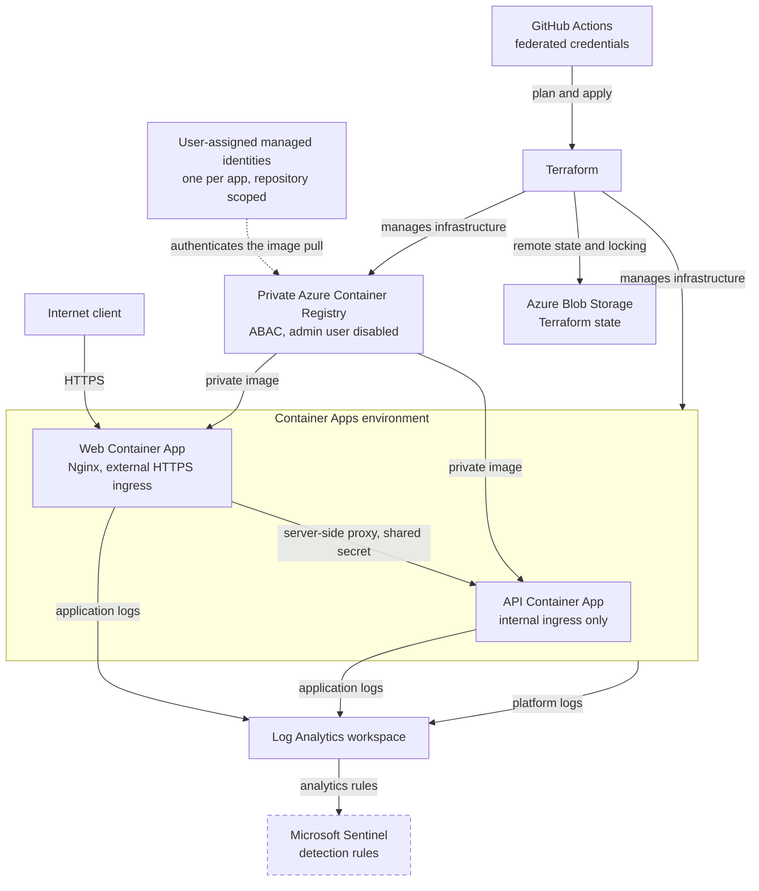

# Azure Container Platform

Two containerised services on Azure Container Apps. A public web tier and an internal API, built and operated with Terraform.
Built in phases, each with a [worklog](docs/worklog/) and a record of the [decisions](docs/decisions.md).

## Architecture



A deeper breakdown of the components, request path, boundaries, and delivery pipeline is in the [architecture notes](docs/architecture.md).

## How it fits together

**Public web app:** the only thing on the internet. Nginx serves a static site and carries an `/api/` location that proxies to the API from inside the container. Because the proxy happens server-side rather than in the browser, the API's hostname never reaches client code, every request the browser makes is to its own origin, and no CORS configuration exists anywhere in the system.

**Internal API:** a FastAPI service reachable only from inside the Container Apps environment. Its hostname resolves publicly, but the environment refuses to route to it, so the web app is the only path in. It reports which revision and replica answered, read from variables Azure injects at runtime, so the page shows what the platform is doing rather than describing it.

**Container Apps environment** is the shared boundary both services live in. It provides ingress and TLS termination, scaling, revisions, health probes, and the internal DNS that lets the web app reach the API without either service knowing the other's address in advance.

**Container Registry:** private, with the admin account disabled. Images are published under immutable version tags, so a deployment names one exact artifact and a rollback is redeploying the previous tag rather than rebuilding anything.

**Managed identity:** how the workloads prove who they are without secrets. The registry grants a read-only role to a user-assigned identity, and each Container App presents that identity when pulling an image. No registry password exists in Terraform, in state, in an environment variable, or in the image.

**Log Analytics:** where both applications and the platform itself send logs. Application logs from each tier land alongside platform events like scaling and revision changes, so a single request can be followed across both services. The web tier records the client's `/24` network rather than their address; the API records no address at all.

**Terraform:** every resource above is declared in code, with state in Azure Blob Storage, locked during changes and versioned for recovery. Nothing is created by hand, so the environment can be read from the repository and rebuilt from it. A separate bootstrap root creates the state backend itself, since it cannot store its own first state.

**Docker and Compose:** both images are built locally and verified before they reach Azure. In the local composition the API publishes no ports and is reachable only from the web container, so the local layout mirrors the internal ingress boundary rather than approximating it.

## Validation

The deployment has been validated through:

- Public HTTPS and health requests
- Container revision health
- Scale from zero to one replica
- Private image retrieval
- Application and platform logs
- Log Analytics request correlation
- Negative-path testing
- Response header and version disclosure checks
- Client address truncation in local and Azure logs
- The API's own hostname returning `404` from outside the environment
- Terraform drift checks

Validation evidence, implementation phases, decisions, and troubleshooting records are available under [`docs/`](docs/README.md). Step-by-step records with screenshot evidence are in the [worklog](docs/worklog/).

## Repository structure

```text
container-app-in-azure/
|-- .github/
|   `-- workflows/
|-- app/
|   |-- api/
|   `-- web/
|-- docs/
|   |-- images/
|   |-- phases/
|   |-- validation-testing/
|   |-- worklog/
|   |-- architecture.md
|   |-- decisions.md
|   `-- troubleshooting.md
|-- terraform/
|   |-- bootstrap/
|   `-- modules/
|-- compose.yaml
`-- README.md
```

`.github/workflows/` holds the plan, security, and deploy pipelines. `terraform/bootstrap/` is the root a human applies, holding the state backend and everything that grants access.

`compose.yaml` runs both containers locally, with the API publishing no ports so the local layout mirrors internal ingress.

Terraform state and saved plan files are not committed to Git.

## Project status

The lab is completed. Every deployed component in the diagram above is built, validated, and documented, and the platform runs unattended through the pipeline.

**Note: The container app and website is no longer in use**
