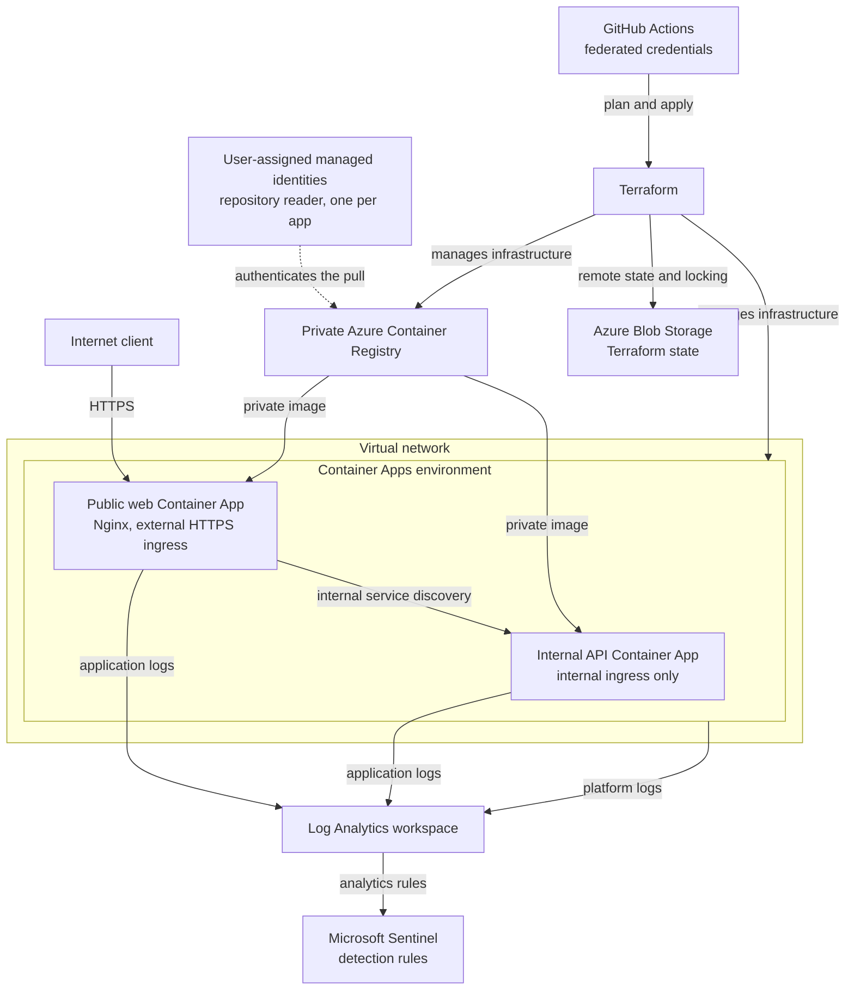

# Azure Container Platform

A cloud engineering project for building, deploying, securing, operating, and validating container workloads on Azure.

Everything managed with Terraform and built in documented phases. Each architectural choice is recorded with the alternative that was rejected, each phase has a worklog with the evidence behind claims, and unresolved gaps are tracked as open items rather than left out.

## Live Container App

[Cloud Operations Lab](https://ca-container-scale-lab-web-dev.graysand-e63d8c5e.norwayeast.azurecontainerapps.io)

Both services scale to zero when idle, so the first request after a quiet period may be slow or time out while a container starts. A retry succeeds. The site may also be briefly unavailable during a release.

## Current status

| Component | Status |
|---|---|
| Resource group | Deployed |
| Log Analytics | Deployed |
| Container Apps environment | Deployed |
| Azure Container Registry | Deployed |
| Managed pull identity | Deployed |
| Remote Terraform state | Deployed |
| Public web Container App | Deployed |
| Routing and response hardening | Deployed |
| Network-level request logging | Deployed |
| Internal API Container App | Deployed |
| Same-origin proxy from web to API | Deployed |
| Operational validation | In progress |
| Per-app identities with repository conditions | Next |
| Automated delivery with federated credentials | Planned |
| VNet-integrated environment | Planned |
| Private endpoints for registry and state | Planned |
| Container image scanning | Planned |
| Microsoft Sentinel detection rules | Planned |
| Scaling and recovery tests | Planned |

## Target architecture

The complete design. The status table above tracks how much of it exists so far.



## Technology

- Terraform
- Azure Container Apps
- Azure Container Registry
- Managed identity
- Azure RBAC and ABAC
- Log Analytics
- Docker
- Nginx
- Python and FastAPI

## Current deployment

Two container apps share one environment and one read-only pull identity.

**Public web app** — Nginx serving a static site, image `web:0.2.0`

- Azure-managed HTTPS on external ingress
- Real `404` responses for missing paths
- No web server version in responses
- Four protective response headers, applied to proxied responses as well
- Access logs truncated to the client `/24` network
- A `/api/` location proxying to the internal API, so the browser only ever calls its own origin

**Internal API** — FastAPI, image `api:0.1.0`

- Internal ingress only. The hostname resolves publicly, but the environment refuses to route to it
- The version reported at runtime comes from the deployed image tag, so the two cannot drift
- Requests are logged without any client address

Both apps run on Linux AMD64, pull private images with managed identity and no registry password, carry startup, readiness and liveness probes, scale from zero to one replica, and are tagged by component for cost and inventory views.

## Validation

The deployment has been validated through:

- Public HTTPS and health requests
- Container revision health
- Scale from zero to one replica
- Private image retrieval
- Application and platform logs
- Log Analytics request correlation
- Negative-path testing
- Response header and version disclosure checks
- Client address truncation in local and Azure logs
- The API's own hostname returning `404` from outside the environment
- Terraform drift checks

Validation evidence, implementation phases, decisions, and troubleshooting records are available under [`docs/`](docs/README.md). Step-by-step records with screenshot evidence are in the [worklog](docs/worklog/).

## Known open items

Tracked as issues rather than left implicit:

- Upstream TLS verification between web and API is disabled, pending a certificate chain check
- The API's schema and health endpoints are readable through the public proxy
- The API has no authentication and relies on internal ingress alone
- A cold start after a long idle can return `504` to the first request
- The recon path checks have not been re-run against the deployed site

## Repository structure

```text
container-app-in-azure/
|-- app/
|   |-- api/
|   `-- web/
|-- docs/
|   |-- images/
|   |-- phases/
|   |-- validation-testing/
|   `-- worklog/
|-- terraform/
|-- compose.yaml
`-- README.md
```

`compose.yaml` runs both containers locally, with the API publishing no ports so the local layout mirrors internal ingress.

Terraform state and saved plan files are not committed to Git.

## Next milestone

Split the shared pull identity into one identity per app, scoped with ABAC repository conditions, so each service can pull only its own images.