# Azure Container Platform

Two containerised services on Azure Container Apps. A public web tier and an internal API, built and operated with Terraform.

Built in phases, each with a [worklog](docs/worklog/) and a record of the [decisions](docs/decisions.md).

## Live Container App

[Cloud Operations Lab (web app)](https://ca-container-scale-lab-web-dev.graysand-e63d8c5e.norwayeast.azurecontainerapps.io)

Both services scale to zero when idle, so the first request after a quiet period may be slow or time out while a container starts. A retry succeeds. The site may also be briefly unavailable during a release.

## Architecture

The complete design. The status table above tracks how much of it exists so far.

```mermaid
flowchart TB
    U["Internet client"]

    subgraph VNET["Virtual network"]
        subgraph CAE["Container Apps environment"]
            WEB["Public web Container App<br/>Nginx, external HTTPS ingress"]
            API["Internal API Container App<br/>internal ingress only"]
        end
    end

    SQL["Azure SQL Database"]
    ACR["Private Azure Container Registry"]
    MI["User-assigned managed identities<br/>repository reader, one per app"]
    LAW["Log Analytics workspace"]
    SENT["Microsoft Sentinel<br/>detection rules"]
    ST["Azure Blob Storage<br/>Terraform state"]
    TF["Terraform"]
    GHA["GitHub Actions<br/>federated credentials"]

    U -->|"HTTPS"| WEB
    WEB -->|"server-side proxy over internal ingress"| API
    API -->|"passwordless connection"| SQL
    MI -.->|"authenticates the image pull"| ACR
    MI -.->|"authenticates the database connection"| SQL
    ACR -->|"private image"| WEB
    ACR -->|"private image"| API
    WEB -->|"application logs"| LAW
    API -->|"application logs"| LAW
    CAE -->|"platform logs"| LAW
    LAW -->|"analytics rules"| SENT
    TF -->|"manages infrastructure"| CAE
    TF -->|"manages infrastructure"| ACR
    TF -->|"manages infrastructure"| SQL
    TF -->|"remote state and locking"| ST
    GHA -->|"plan and apply"| TF
```



## Current status

| Component | Status |
|---|---|
| Resource group | Deployed |
| Log Analytics | Deployed |
| Container Apps environment | Deployed |
| Azure Container Registry | Deployed |
| Managed pull identity | Deployed |
| Remote Terraform state | Deployed |
| Public web Container App | Deployed |
| Routing and response hardening | Deployed |
| API authentication and upstream TLS | Deployed |
| Network-level request logging | Deployed |
| Internal API Container App | Deployed |
| Same-origin proxy from web to API | Deployed |
| Multiple revisions with traffic-weight rollback | Deployed |
| Scaling above one replica | Deployed |
| Automated delivery with federated credentials | Deployed |
| Operational validation | In progress |
| Per-app identities with repository conditions | Next |
| Azure SQL Database with Entra authentication | Planned |
| VNet-integrated environment | Not pursued, see decisions |
| Private endpoints for registry, state, and database | Potential |
| Container image scanning | Potential |
| Microsoft Sentinel detection rules | Potential |
| Scaling and recovery tests | Potential |

## How it fits together

**Public web app:** the only thing on the internet. Nginx serves a static site and carries an `/api/` location that proxies to the API from inside the container. Because the proxy happens server-side rather than in the browser, the API's hostname never reaches client code, every request the browser makes is to its own origin, and no CORS configuration exists anywhere in the system.

**Internal API:** a FastAPI service reachable only from inside the Container Apps environment. Its hostname resolves publicly, but the environment refuses to route to it, so the web app is the only path in. It reports which revision and replica answered, read from variables Azure injects at runtime, so the page shows what the platform is doing rather than describing it.

**Database:** *(potential)* Azure SQL Database, connected to by the API using its managed identity rather than a password in a connection string. It gives the application something real to hold: which revisions have served traffic, and when the platform last scaled up from zero.

**Container Apps environment** is the shared boundary both services live in. It provides ingress and TLS termination, scaling, revisions, health probes, and the internal DNS that lets the web app reach the API without either service knowing the other's address in advance.

**Container Registry:** private, with the admin account disabled. Images are published under immutable version tags, so a deployment names one exact artifact and a rollback is redeploying the previous tag rather than rebuilding anything.

**Managed identity:** how the workloads prove who they are without secrets. The registry grants a read-only role to a user-assigned identity, and each Container App presents that identity when pulling an image. No registry password exists in Terraform, in state, in an environment variable, or in the image. The database will authenticate the same way.

**Log Analytics:** where both applications and the platform itself send logs. Application logs from each tier land alongside platform events like scaling and revision changes, so a single request can be followed across both services. The web tier records the client's `/24` network rather than their address; the API records no address at all.

**Terraform:** every resource above is declared in code, with state in Azure Blob Storage, locked during changes and versioned for recovery. Nothing is created by hand, so the environment can be read from the repository and rebuilt from it. A separate bootstrap root creates the state backend itself, since it cannot store its own first state.

**Docker and Compose:** both images are built locally and verified before they reach Azure. In the local composition the API publishes no ports and is reachable only from the web container, so the local layout mirrors the internal ingress boundary rather than approximating it.

## Current deployment

Two container apps share one environment and one read-only pull identity.

**Public web app:** Nginx serving a static site, image `web:0.2.0`

- Azure-managed HTTPS on external ingress
- Real `404` responses for missing paths
- No web server version in responses
- Four protective response headers, applied to proxied responses as well
- Access logs truncated to the client `/24` network
- A `/api/` location proxying to the internal API, so the browser only ever calls its own origin

**Internal API:** FastAPI, image `api:0.1.0`

- Internal ingress only. The hostname resolves publicly, but the environment refuses to route to it
- The version reported at runtime comes from the deployed image tag, so the two cannot drift
- Requests are logged without any client address

Both apps run on Linux AMD64, pull private images with managed identity and no registry password, carry startup, readiness and liveness probes, scale from zero to one replica, and are tagged by component for cost and inventory views.

## Validation

The deployment has been validated through:

- Public HTTPS and health requests
- Container revision health
- Scale from zero to one replica
- Private image retrieval
- Application and platform logs
- Log Analytics request correlation
- Negative-path testing
- Response header and version disclosure checks
- Client address truncation in local and Azure logs
- The API's own hostname returning `404` from outside the environment
- Terraform drift checks

Validation evidence, implementation phases, decisions, and troubleshooting records are available under [`docs/`](docs/README.md). Step-by-step records with screenshot evidence are in the [worklog](docs/worklog/).

## Known open items

Tracked as issues rather than left implicit:
- A cold start after a long idle can return `504` to the first request


## Repository structure

```text
container-app-in-azure/
|-- app/
|   |-- api/
|   `-- web/
|-- docs/
|   |-- images/
|   |-- phases/
|   |-- validation-testing/
|   `-- worklog/
|-- terraform/
|-- compose.yaml
`-- README.md
```

`compose.yaml` runs both containers locally, with the API publishing no ports so the local layout mirrors internal ingress.

Terraform state and saved plan files are not committed to Git.

## Next milestone

Split the shared pull identity into one identity per app, scoped with ABAC repository conditions, so each service can pull only its own images.
