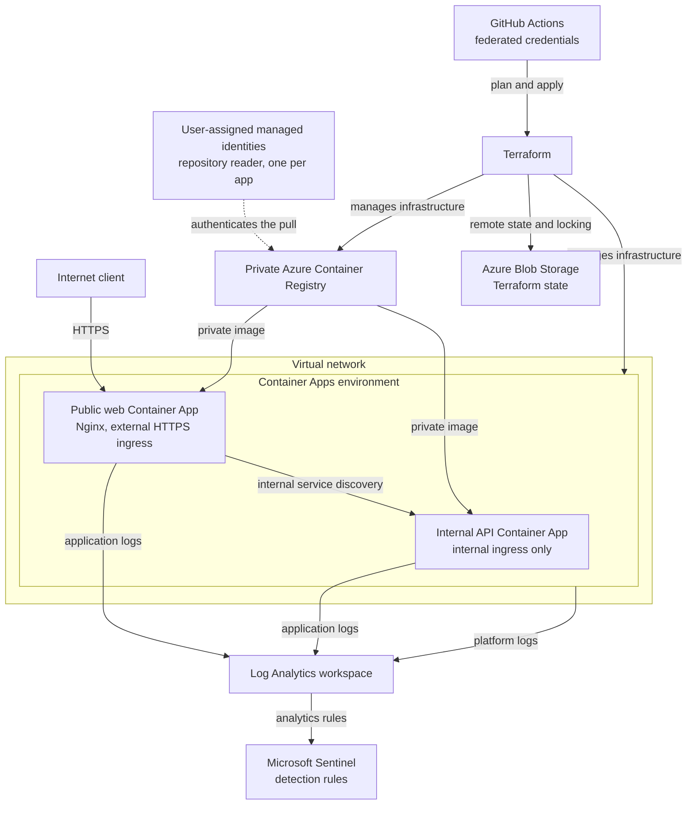

# Azure Container Platform

An ongoing cloud engineering project for building, deploying, securing, operating, and validating container workloads on Azure.

The platform is built with Terraform and follows a documented workflow covering infrastructure changes, container releases, managed identity, health checks, revisions, observability, testing, and troubleshooting.

## Live Container App

[Cloud Operations Lab](https://ca-container-scale-lab-web-dev.graysand-e63d8c5e.norwayeast.azurecontainerapps.io)

The app scales to zero when idle, so the first request may take a moment while a container starts. It may also be briefly unavailable during maintenance or a new release.

## Current status

| Component | Status |
|---|---|
| Resource group | Deployed |
| Log Analytics | Deployed |
| Container Apps environment | Deployed |
| Azure Container Registry | Deployed |
| Managed pull identity | Deployed |
| Remote Terraform state | Deployed |
| Public web Container App | Deployed |
| Routing and response hardening | Deployed |
| Network-level request logging | Deployed |
| Operational validation | In progress |
| Internal API Container App | Next |
| Per-app identities with repository conditions | Planned |
| VNet-integrated environment | Planned |
| Private endpoints for registry and state | Planned |
| Container image scanning | Planned |
| Microsoft Sentinel detection rules | Planned |
| Scaling and recovery tests | Planned |
| Automated delivery with federated credentials | Planned |

## Target architecture

The complete design. The status table above tracks how much of it exists so far.


## Technology

- Terraform
- Azure Container Apps
- Azure Container Registry
- Managed identity
- Azure RBAC and ABAC
- Log Analytics
- Docker
- Nginx

## Current deployment

The public application runs as an Nginx container using:

- Immutable image tag `web:0.1.2`
- Linux AMD64 image
- Private ACR delivery
- Password-free managed identity pulls
- Startup, readiness, and liveness probes
- Scale range from zero to one replica
- Azure-managed HTTPS
- Real `404` responses for missing paths
- No web server version in responses
- Four protective response headers
- Access logs truncated to the client `/24` network
- Remote Terraform state with locking and recovery controls

## Validation

The deployed application has been validated through:

- Public HTTPS and health requests
- Container revision health
- Scale from zero to one replica
- Private image retrieval
- Application and platform logs
- Log Analytics request correlation
- Negative-path testing
- Response header and version disclosure checks
- Client address truncation in local and Azure logs
- Terraform drift checks

Validation evidence, implementation phases, decisions, and troubleshooting records are available under [`docs/`](docs/README.md). Step-by-step records with screenshot evidence are in the [worklog](docs/worklog/).

## Repository structure

```text
container-app-in-azure/
|-- app/
|   `-- web/
|-- docs/
|   |-- images/
|   |-- phases/
|   |-- validation-testing/
|   `-- worklog/
|-- terraform/
`-- README.md
```

Terraform state and saved plan files are not committed to Git.

## Next milestone

Re-run the recon path checks against the hardened deployment, validate Azure Monitor metrics and horizontal scaling, then deploy an internal API Container App.
