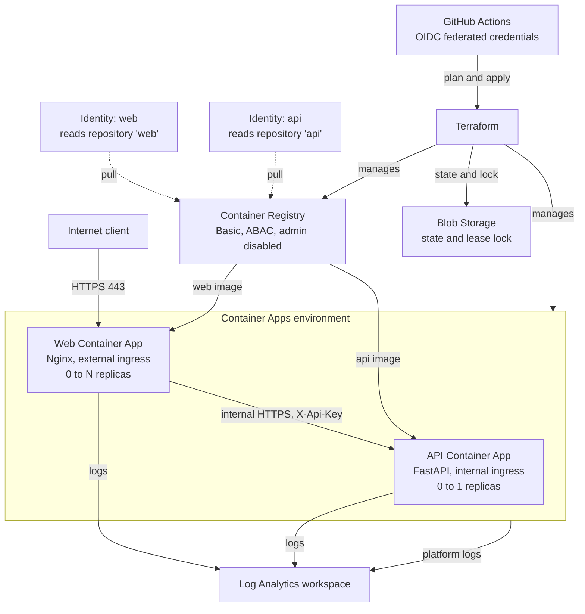
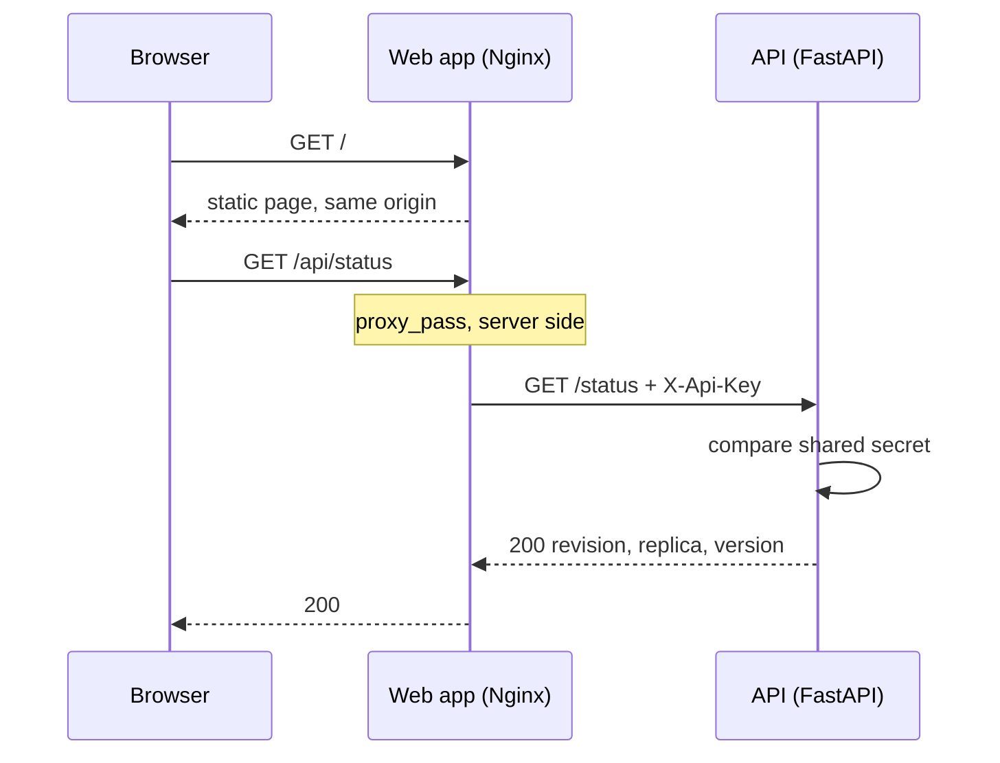

# Architecture

How the platform is put together, what talks to what, and which boundary stops what.

Everything described here is deployed. Anything not deployed is listed under [What is deliberately absent](#what-is-deliberately-absent).

## Components

| Component | Resource | Notes |
|---|---|---|
| Web app | `azurerm_container_app` | Nginx, external HTTPS ingress, 0 to N replicas |
| API | `azurerm_container_app` | FastAPI, internal ingress only, 0 to 1 replicas |
| Environment | `azurerm_container_app_environment` | Consumption plan, shared by both apps |
| Registry | `azurerm_container_registry` | Basic tier, admin user disabled, ABAC repository permissions |
| Identities | `azurerm_user_assigned_identity` | One per app, each scoped to a single repository |
| Logs | `azurerm_log_analytics_workspace` | 30 day retention, receives app and platform logs |
| State | Azure Blob Storage | Terraform state with lease based locking |



## The request path

A browser only ever talks to one origin. The API's hostname never reaches client code.



The proxy happens inside the web container rather than in the browser. Three consequences follow:

1. Every request the browser makes goes to its own origin, so no CORS configuration exists anywhere in the system.
2. The API hostname is never exposed to client code.
3. The API can refuse anything that does not carry the shared secret, because only the proxy is meant to call it.

## Boundaries

Three separate controls, each doing a different job.

**Network.** The API sets `external_enabled = false`. Its hostname resolves publicly, but the environment refuses to route to it from outside. The web app is the only path in.

**Authentication between the apps.** Terraform generates a 48 character shared secret with `random_password`, stores it as a Container App secret on both apps, and never writes it to Git. Nginx sends it as `X-Api-Key` on every proxied request. The API requires it on every route except `/health`, which the platform probes call directly.

**Registry access.** Each app has its own identity holding `Container Registry Repository Reader`, restricted by an ABAC condition to one repository:

```text
(
 (
  !(ActionMatches{'...repositories/content/read'})
  AND
  !(ActionMatches{'...repositories/metadata/read'})
 )
 OR
 (
  @Request[...repositories:name] StringEqualsIgnoreCase 'web'
 )
)
```

The condition is the entire mechanism. The same role assigned without one is registry wide. The shape matters too: it allows anything that is not a repository read, then constrains repository reads by name, so it does not deny actions it was never meant to describe.

The registry has `admin_enabled = false`, so no username and password pair exists to leak.

## Scaling and revisions

Both apps scale from zero. The web app scales to `var.web_max_replicas` on an HTTP rule measuring concurrent requests. The API is capped at one replica, since nothing needs more.

Scale to zero is why the platform is cheap and also why there is often nothing running to inspect. An `az containerapp exec` against an idle app fails with no replica found until a request wakes it.

The web app runs in `Multiple` revision mode so traffic can be split:

```hcl
revision_suffix = "${replace(var.image_tag, ".", "-")}-${local.config_hash}"
```

The suffix combines the version with a six character hash of the values that should force a new revision: image tag, max replicas, concurrent requests, and upstream FQDN. The tag alone repeats when only configuration changes, which would leave a revision serving stale settings under a name implying otherwise.

`max_inactive_revisions = 5` keeps previous revisions alive, because a rollback needs something to roll back to. Rollback is a traffic weight change rather than a redeploy, so it takes effect without a build.

Both containers carry startup, readiness, and liveness probes on `/health`, all on port 8080.

## Delivery

Two Terraform roots with different trust levels.

| Root | Applied by | Holds |
|---|---|---|
| `terraform/bootstrap/state-backend` | A human | State backend, CI identity, federated credentials, app identities and their role assignments |
| `terraform/` | GitHub Actions | Resource group, environment, registry, both apps |

The pipeline identity holds Contributor, which deliberately excludes managing role assignments. So anything that grants access lives in the root a human applies, and the pipeline only reads those identities through a data source.

This is not about limiting damage. The pipeline can already delete the registry and both apps. Destruction is loud and rebuilt from code in minutes, while a quietly granted permission persists and nobody notices.

Authentication to Azure uses OIDC federated credentials, so no secret is stored in GitHub. The subjects must match byte for byte, and the deploy credential includes an environment claim in place of the ref claim, which is what makes the deployment wait for approval.

On every pull request: format, validate, lint, security scan, image scan, and a plan posted as a comment. On merge: build, apply, and a smoke test that proves the deployment serves traffic before the run is called green.

Both workflows share a `terraform-state` concurrency group, so plans and applies queue rather than collide on the state lease.

## Observability

The environment sends platform logs to Log Analytics, and both apps send application logs there. Retention is 30 days.

Request logging happens at the network level rather than in application code. Azure truncates client addresses in the logs it emits, which is a privacy property of the platform rather than something the applications implement.

## What is deliberately absent

**Private networking.** VNet integration cannot be added to an existing Container Apps environment, so it means rebuilding the environment and moving both apps. It also bills continuously and ends the scale to zero behaviour the platform relies on. Evaluated and deferred on cost and effort, not judged unnecessary.

**A database.** One was built and removed, because nothing connected to it. See [phase 17](worklog/phase-17-sql-database-built-and-removed.md).

**Microsoft Sentinel.** Detection rules on top of the workspace remain a potential addition.

Reasoning for these, with the alternatives that were rejected, is in the [decision log](decisions.md).
