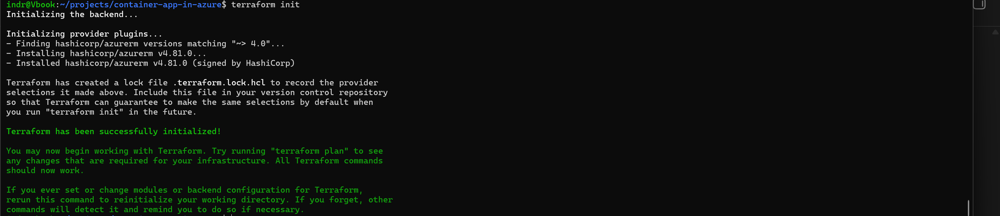

# Phase 1: Repository and Terraform Bootstrap

## Goal

Create a repeatable project workspace with source control and Terraform.

## Completed

- Created the WSL project directory.
- Initialized Git with `main` as the default branch.
- Created the GitHub repository.
- Added Terraform and AzureRM version constraints.
- Added ignore rules for state, plans, and local Terraform data.
- Practiced feature branches and pull requests.

## Validated

- Terraform initialized successfully.
- Provider versions were recorded in `.terraform.lock.hcl`.
- Terraform formatting and validation passed.
- The first feature branch merged through GitHub.

