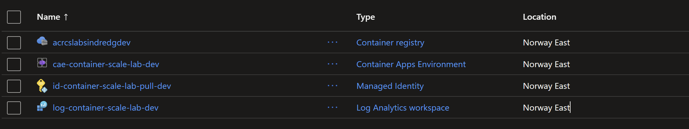

# Phase 2: First Azure Resource

## Goal

Deploy the first Azure resource through reviewed Terraform code.

## Completed

- Added location, naming, and common tag variables.
- Defined the development resource group.
- Added useful Terraform outputs.
- Created and reviewed a saved plan.
- Applied the approved resource-group change.

## Validated

- Terraform created one resource and destroyed none.
- The resource group appeared in Azure.
- A final plan reported no changes.
- The feature branch merged through a pull request.

