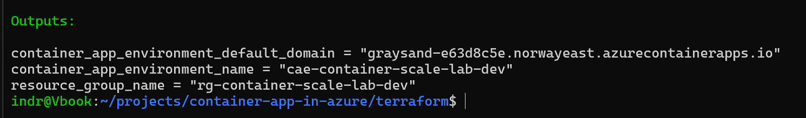

# Phase 3: Container Apps Environment

## Goal

Create the shared runtime and logging boundary for the container applications.

## Completed

- Deployed a Log Analytics workspace.
- Deployed an Azure Container Apps environment.
- Registered the `Microsoft.App` provider after Azure rejected the first attempt.
- Generated a fresh plan after the partial apply.

## Validated

- Terraform state contained the workspace and environment.
- Terraform returned the environment name and default domain.
- The retry created only the missing resource.
- A final plan reported no changes.

