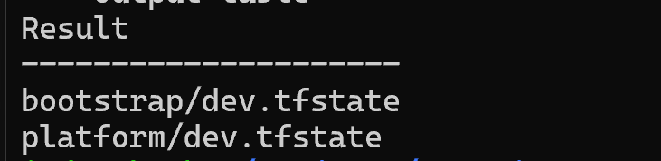

# Phase 5: Remote Terraform State

## Goal

Protect Terraform state and support safe shared operations.

## Completed

- Created a separate backend bootstrap root.
- Deployed a private Azure Blob container.
- Migrated bootstrap and platform state to separate keys.
- Enabled blob versioning and 30-day soft delete.
- Added a delete lock to the storage account.
- Used Microsoft Entra authentication for backend access.

## Validated

- Both remote state keys existed.
- Both Terraform roots reported no changes.
- Local recovery copies were removed after verification.
- Normal Terraform commands acquired remote state locks.

