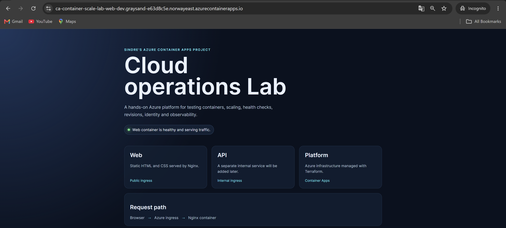

# Phase 7: Public Web Container App

## Goal

Publish the web image privately and deploy it through public Azure-managed HTTPS ingress.

## Completed

- Published immutable image tags `0.1.0` and `0.1.1` to ACR.
- Built the deployment images for `linux/amd64`.
- Deployed the public web Container App with Terraform.
- Used managed identity for private image pulls.
- Configured startup, readiness, and liveness probes.
- Configured a zero-to-one replica baseline.
- Released the branded Cloud Operations Lab page.

## Validated

- Registry manifests reported `linux/amd64`.
- Terraform created the app without replacing platform resources.
- The public website and `/health` returned HTTP `200`.
- The active revision was healthy and received all traffic.
- The branded update changed one resource and created a new revision.
- A final plan reported no changes.

