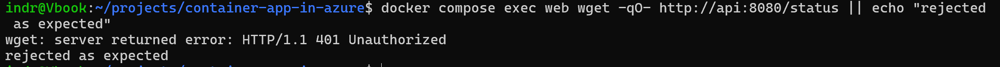
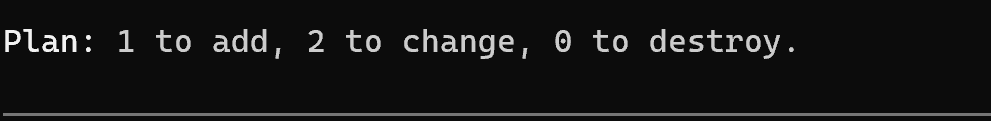

# Phase 11: API Authentication and Upstream TLS

## Goal

Close the three security items left open by the internal API work: no authentication, a public schema, and unverified upstream TLS.

## Completed

- Generated a shared secret with Terraform and held it as a Container Apps secret on both apps.
- Required the secret on every API route except `/health`, which the platform probes call directly.
- Compared it with a constant-time check so the value cannot be recovered by timing.
- Turned on upstream certificate verification, with a trust store in the web image and a verify depth above the default.
- Made the generated schema opt-in and off by default.
- Released `api:0.2.0` and `web:0.3.0`.

## Validated

- `/api/status` through the public site returns `200` with the real revision and replica.
- A direct call to the API without the header returns `401`.
- `/api/openapi.json` returns `404`.
- The `200` through the proxy also proves certificate verification works, because the request fails closed if the trust store cannot verify the endpoint.

