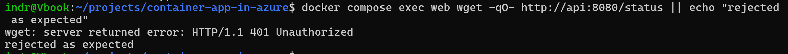

# Phase 14: Supply Chain Scanning

## Goal

Inspect what goes into the images this project ships, and scan the Terraform that deploys them.

## Completed

- Added TFLint, Checkov, and Trivy to every pull request.
- Set only TFLint to block a merge, with the other two reporting into the Security tab.
- Built images inside the scan job, so a change is inspected before it is ever published.
- Upgraded FastAPI, Uvicorn, and Starlette to clear the findings in packages this project chose.
- Pinned Starlette directly, since it carried the findings and serves every request.

## Validated

- The first scan returned 100 findings: seven in a chosen dependency, ninety three in the base image userland.
- All three criticals were Perl vulnerabilities in a Python base image, which the API never invokes.
- After the upgrade, a call to the API without the shared secret still returns `401`.

The last point mattered most. Starlette moved across a major version, and the authentication added earlier depends on its middleware ordering. A working request proves the key is accepted, not that a missing one is refused.

