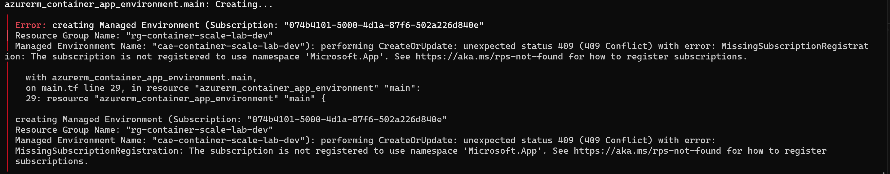

# Troubleshooting Log

## Container Apps provider was not registered

**Symptom:** Azure returned `MissingSubscriptionRegistration` for `Microsoft.App`.

**Cause:** The subscription had not enabled the resource provider used by Container Apps.

**Fix:** Register `Microsoft.App`, create a fresh Terraform plan, and apply the remaining change.

## Nginx container exited immediately

**Symptom:** Nginx reported that the `server` directive was not allowed in `/etc/nginx/nginx.conf`.

**Cause:** A site-level `server` block replaced the complete top-level Nginx configuration.

**Fix:** Copy the site file to `/etc/nginx/conf.d/default.conf`, rebuild the image, and verify it with `nginx -t`.

## Docker marked a working site unhealthy

**Symptom:** Host requests returned HTTP `200`, but Docker health checks received connection refused.

**Cause:** The in-container check used `localhost`. The application was reachable through the IPv4 loopback listener.

**Fix:** Use `http://127.0.0.1:8080/health`, rebuild the image, and recreate the container.

## Cancelled Terraform plan left a state lease

**Symptom:** Terraform reported that the state blob was already locked and provided no lock ID.

**Cause:** A cancelled plan ended before releasing its Azure Blob lease.

**Fix:** Confirm no Terraform process is active. Break the lease on the exact state blob. Run the plan again with normal locking enabled.

## Saved plan appeared in Git status

**Symptom:** The local plans directory appeared as untracked.

**Cause:** A filename used `.tfoplan` instead of the ignored `.tfplan` extension.

**Fix:** Inspect the exact untracked path and remove the disposable misspelled plan.

## Header check against the API returned 405

**Symptom:** `curl -I` against an API route returned `405 Method Not Allowed` with `allow: GET`.

**Cause:** `curl -I` sends `HEAD`. FastAPI's `@app.get` registers `GET` only, unlike plain Starlette, which answers `HEAD` for a `GET` route.

**Fix:** Use a `GET` that discards the body: `curl -sD - -o /dev/null <url>`.

## Proxied API path returned 404 instead of reaching the API

**Symptom:** `/api/status` returned `404` from nginx on the public site, while the API itself was healthy.

**Cause:** The `API_UPSTREAM` environment variable applied, but the image tag was never moved, so the running web image predated the `/api/` proxy block.

**Fix:** Move `web_image_tag` to the image that contains the proxy configuration and apply.

