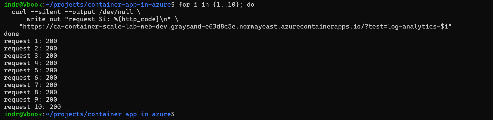
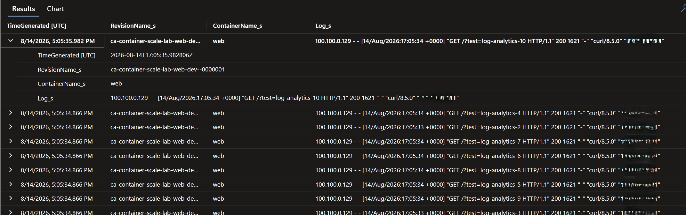
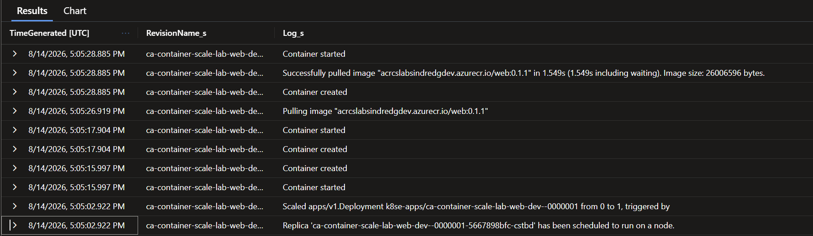
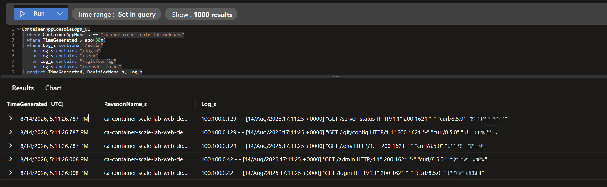

# Log Analytics and Route Validation

## Goal

Validate the public Container App through generated traffic, Azure logs, scale events, and negative-path requests.

## Tests

| Test | Result |
|---|---|
| Ten tagged HTTPS requests | All returned HTTP `200`. |
| Console-log correlation | Requests appeared under the active revision and `web` container. |
| System-log inspection | Azure recorded scale from zero to one, replica scheduling, image pull, creation, and startup. |
| Private ACR retrieval | Image `web:0.1.1` was pulled successfully through the runtime configuration. |
| Negative-path requests | All were logged, but returned HTTP `200` instead of `404`. |

## Evidence







## Finding

Requests to `/admin`, `/login`, `/.env`, `/.git/config`, and `/server-status` returned HTTP `200`.




No sensitive file exposure was demonstrated. Nginx served the normal `index.html` fallback because the configuration uses:

```nginx
try_files $uri $uri/ /index.html;
```

This is useful for a client-routed single-page application. The current site is static, so a real `404` response is more accurate. The routing behavior will be corrected or explicitly accepted before response-code monitoring is added.

## Outcome

Log ingestion, request correlation, private image retrieval, and scale-from-zero were verified. The test also produced an actionable routing finding for the next web release.
