# Phase 1 worklog: Repository and Terraform Bootstrap

## Goal

Establish the engineering workflow before any Azure resource exists: a local repository, a private GitHub remote, an issue-driven branch, version constraints, and a reviewed pull request. Nothing is applied to Azure in this phase.

Related: [decision log](../decisions.md).

## Repository baseline

The project was initialized on `main` inside WSL at `~/projects/container-app-in-azure`.

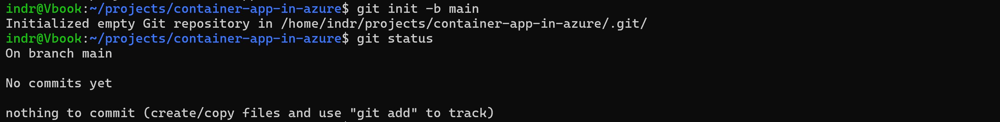

Proves the repository was created on a branch named `main` with no commits yet.

Terraform ignore rules came before the first commit, so state and plans could never be staged by accident.

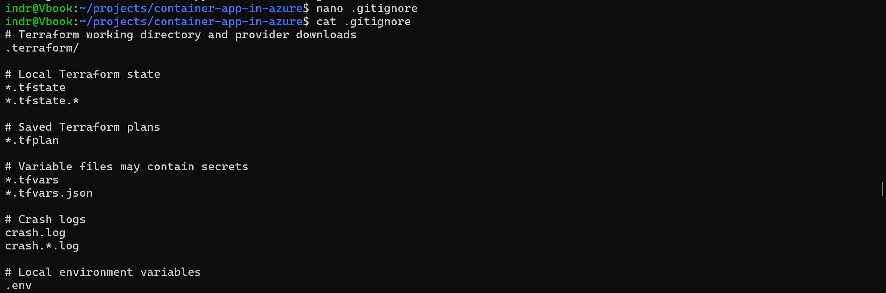

Proves `.gitignore` excludes `.terraform/`, state files, saved plans, `*.tfvars`, crash logs, and `.env`.

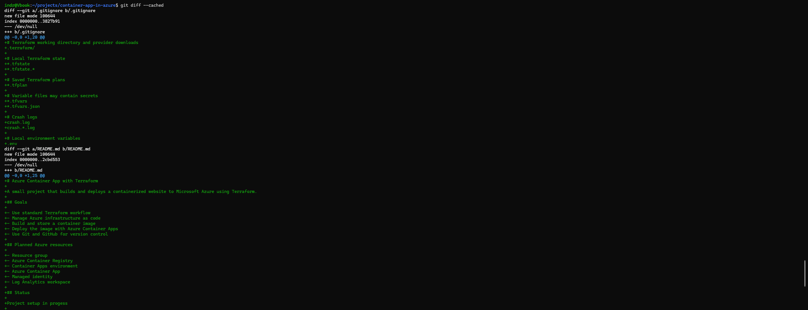

Proves the baseline contents were reviewed as a diff before committing, and that both files were new.

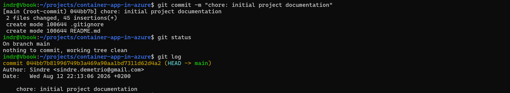

Proves the root commit `044bb7b` recorded two files and left a clean working tree.

## Private remote and issue

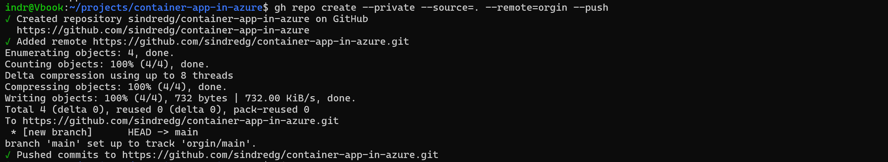

Proves the repository was created with `--private`, and that the remote was registered as `orgin`. That misspelling persists through later phases.

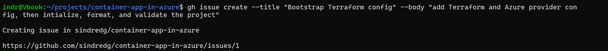

Proves the work was described as issue `#1` before implementation started.

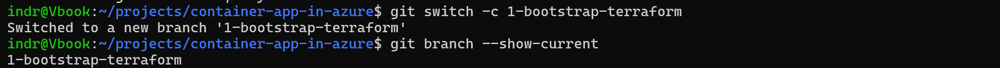

Proves branch `1-bootstrap-terraform` links the branch name back to the issue.

## Terraform bootstrap

Three files were added: version constraints, the provider block, and the generated lock file.

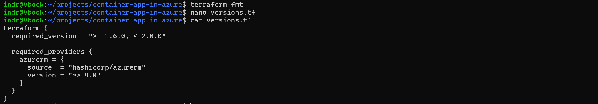

Proves Terraform is pinned to `>= 1.6.0, < 2.0.0` and AzureRM to `~> 4.0`.

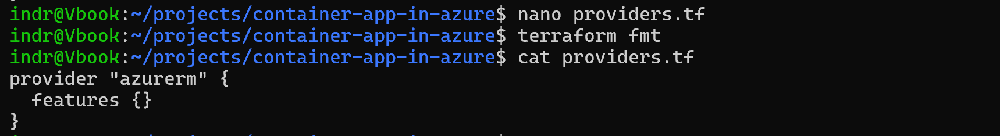

Proves `providers.tf` holds only the `azurerm` block with an empty `features {}`, and no credentials.

The subscription ID stays out of code entirely.

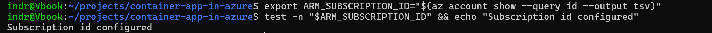

Proves the ID was exported into the shell and confirmed with a non-empty test rather than printed.

Proves `terraform init` installed AzureRM `v4.81.0` and created the lock file, with no Azure resources created.

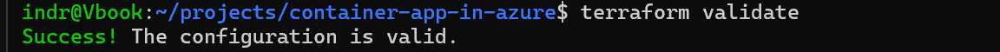

Proves `terraform validate` passed before any commit or review.

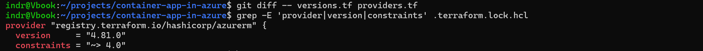

Proves the lock file records the resolved `4.81.0` against the `~> 4.0` constraint.

## Review and merge

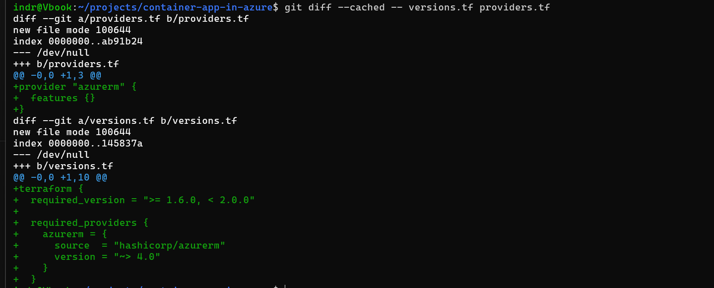

Proves the exact configuration content was reviewed as a staged diff before committing.

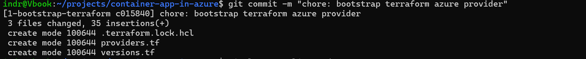

Proves commit `c015840` contained exactly three files.

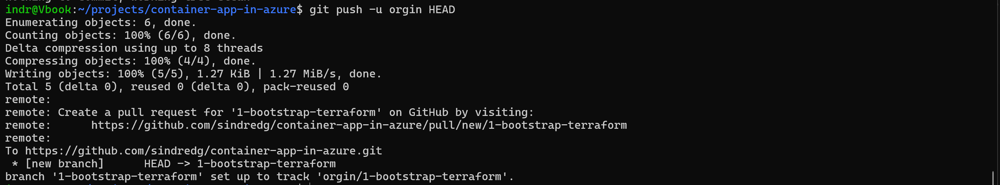

Proves the branch was pushed and tracked without touching `main`.

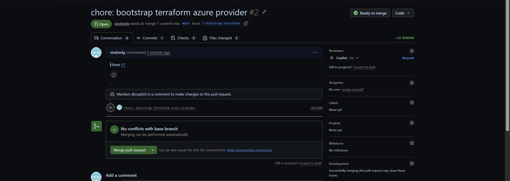

Proves PR `#2` targeted `main`, changed 3 files, and reported no conflicts.

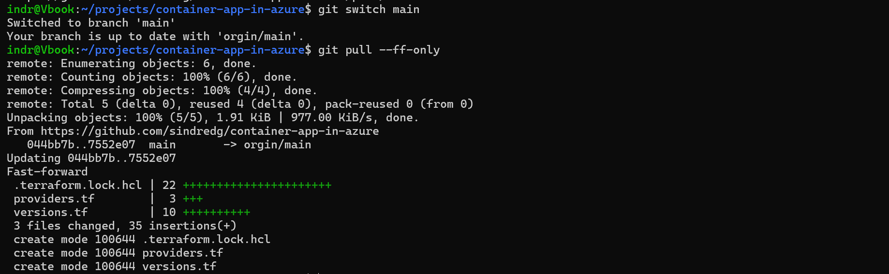

Proves `git pull --ff-only` brought the merged files onto local `main` with no merge commit.

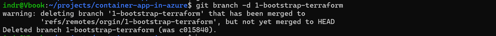

Proves Git warned the branch commit was not an ancestor of `HEAD`, the expected result of a squash merge.

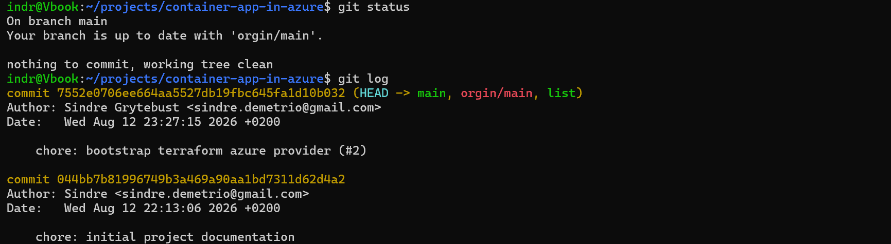

Proves `main` ended clean with the squashed commit on top of the initial commit.
