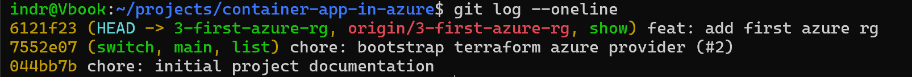

# Phase 2 worklog: First Azure Resource

## Goal

Create the first persistent Azure resource with Terraform: the resource group `rg-container-scale-lab-dev` in Norway East. It is the lifecycle boundary everything later sits inside.

## What was done

Terraform files moved into their own `terraform/` directory, with a local `plans/` directory that Git ignores. Input variables were introduced for `location` (default `norwayeast`) and `environment` (default `dev`), with the name assembled in `locals` and common tags recording `environment`, `managed_by`, and `project`.

The change followed the phase 1 workflow on branch `3-first-azure-rg`:

```bash
terraform fmt
terraform validate
terraform plan -out=plans/rg.tfplan     # Plan: 1 to add, 0 to change, 0 to destroy
terraform apply plans/rg.tfplan
az group show --name rg-container-scale-lab-dev --query properties.provisioningState
terraform state list
terraform plan                          # No changes
```



The work was committed as `feat: add first azure rg` on branch `3-first-azure-rg`, on top of the squash-merged phase 1 commit.

The resource group is visible as the containing scope in phase 4, at `images/phase-04-platform-resources-portal.png`.
