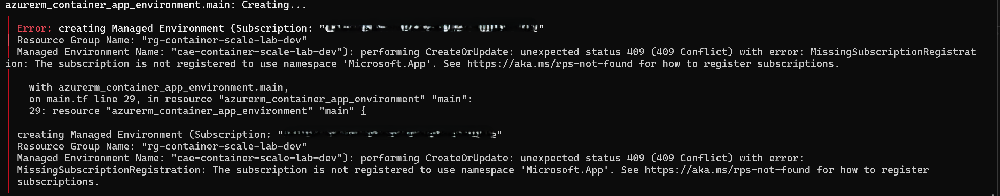
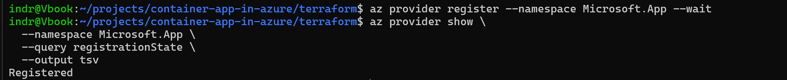

# Phase 3 worklog: Container Apps Environment

## Goal

Add the shared runtime boundary for the future web and API services: a Log Analytics workspace and a Container Apps environment, with environment logs pointed at the workspace.

Related: [use one shared Container Apps environment](../decisions.md).

## What was done

Two resources. The workspace `log-container-scale-lab-dev` uses `PerGB2018` with 30-day retention. The environment `cae-container-scale-lab-dev` sets `logs_destination = "log-analytics"` and references the workspace ID, which makes Terraform create the workspace first.

The reviewed plan was `Plan: 2 to add`. It applied partially: the workspace succeeded, the environment failed.



Proves the 409 Conflict was `MissingSubscriptionRegistration` for namespace `Microsoft.App`, pointing at `main.tf` line 29.

Azure does not roll back resources that already completed, so Terraform kept the workspace in state. Full write-up in the [troubleshooting log](../troubleshooting.md#container-apps-provider-was-not-registered).

```bash
az provider register --namespace Microsoft.App --wait
```



Proves the namespace reached `Registered`, which unblocked the second apply.

The original saved plan was deliberately not reused, because infrastructure state had changed since it was generated. A fresh plan showed only the remaining environment at `Plan: 1 to add`.


Proves the environment exists inside `rg-container-scale-lab-dev` and exposes the Azure-generated domain `graysand-e63d8c5e.norwayeast.azurecontainerapps.io`.
