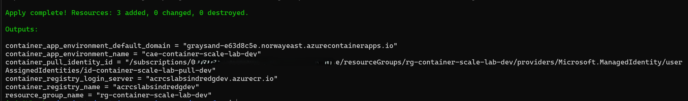
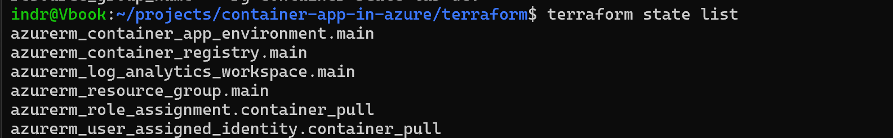
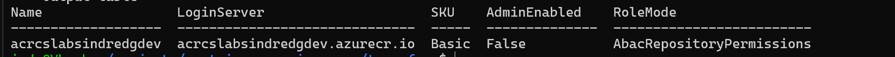
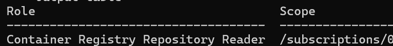
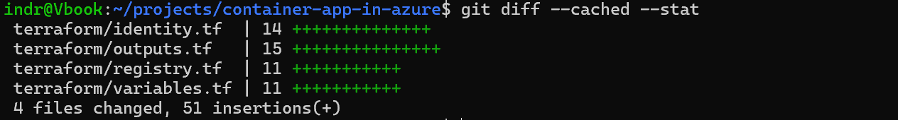

# Phase 4 worklog: Registry and Pull Identity

## Goal

Build the private image supply path before any image exists: a registry with administrator credentials disabled, a user-assigned managed identity, and a read-only role assignment scoped to that registry.

Background: [DEC-017](../decisions.md) and [DEC-018](../decisions.md) cover ABAC repository permissions and the Basic tier without admin credentials.

## What was done

Three resources in one change: the registry, the pull identity, and the role assignment.

```bash
terraform plan -out=plans/acr-and-pull-identity.tfplan   # Plan: 3 to add
terraform apply plans/acr-and-pull-identity.tfplan
```



The apply added exactly 3 resources and returned the registry login server and pull identity outputs.



State now holds the resource group, workspace, environment, registry, identity, and role assignment.

## Registry configuration

`acrcslabsindredgdev` uses Basic with `admin_enabled = false` and `role_assignment_mode = "AbacRepositoryPermissions"`. That mode does not honour the legacy `AcrPull` role, so the project uses `Container Registry Repository Reader`. The name is validated in Terraform against `^[a-z0-9]{5,50}$` before Azure sees the request, since ACR names are globally unique and reject hyphens.



`AdminEnabled` is `False` and `RoleMode` is `AbacRepositoryPermissions` on the live registry, not just in configuration.

## Pull identity

`id-container-scale-lab-pull-dev` exists independently of any Container App, so it can be authorised before the first private pull. It has no password or client secret. The role assignment sets `skip_service_principal_aad_check = true` to avoid a lookup race straight after creating the identity.



The identity's only assignment is read-only, so the running application cannot push or delete images.

## Review



Only source files were staged, with generated plans and state excluded.


The registry, environment, managed identity, and workspace all exist in `rg-container-scale-lab-dev` in Norway East.

This phase created storage and authorisation for images only. Nothing was built, pushed, or deployed.
