# Phase 5 worklog: Remote Terraform State

## Goal

Move Terraform state out of local WSL files into a protected Azure Blob Storage backend, with two independent root modules sharing one private container under different blob keys.

Related: [store Terraform state in Azure Blob Storage](../decisions.md).

## Backend

A separate root at `terraform/bootstrap/state-backend/` creates the backend itself, which solves the ordering problem: the backend cannot store its own first state until the storage resources exist.

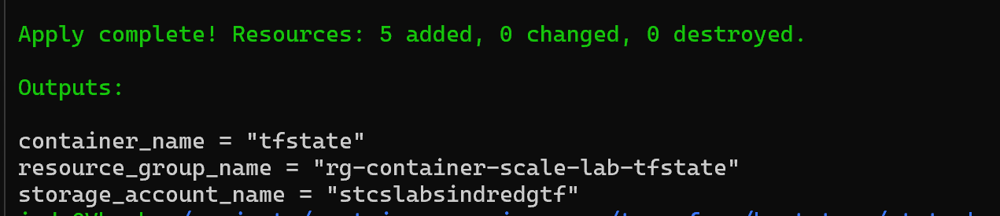

Proves the bootstrap root added 5 resources and returned the storage account, container, and resource group names.

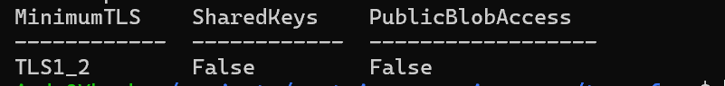

Proves the account enforces TLS 1.2 minimum, has shared key authentication disabled, and blocks public blob access.

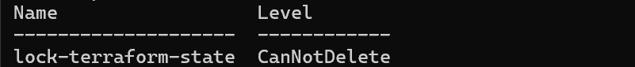

Proves the `lock-terraform-state` management lock is set to `CanNotDelete`.

## Two keys, one container

Authentication is Entra-based throughout. The provider sets `storage_use_azuread = true`, and each backend declares `use_azuread_auth = true` and `use_cli = true`, so state operations run as the identity from `az login`. Shared access keys are disabled on the account, which makes this the only path that works.

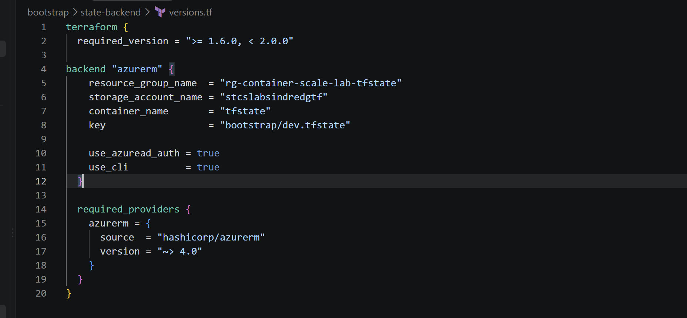

Proves the bootstrap root targets key `bootstrap/dev.tfstate`.

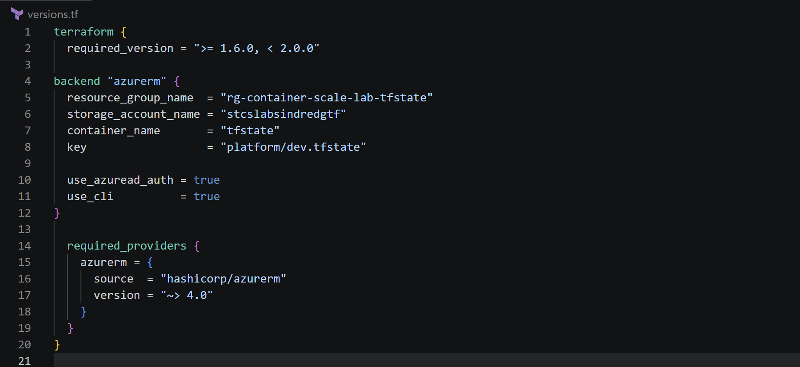

Proves the platform root uses the same account and container but the different key `platform/dev.tfstate`.

Different keys keep the states independent: a command run in the bootstrap root cannot touch the six platform resources, because they are not in its state.

## Migration

Local state was copied to `~/.terraform-state-backups/` outside the repository first. Both roots were then migrated:

```bash
terraform init -migrate-state   # answer: yes
```

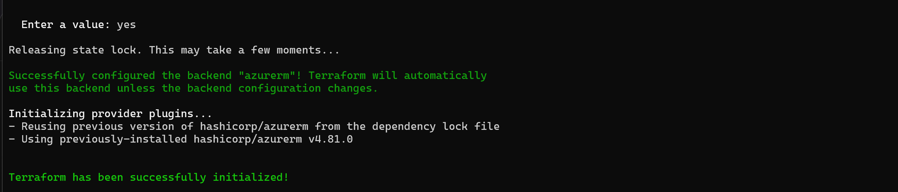

Proves the migration prompt was answered `yes` and the `azurerm` backend was configured.

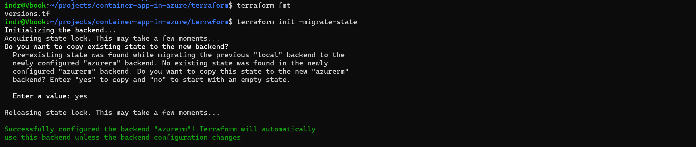

Proves the platform root was migrated the same way, copying pre-existing state.

Migration moves Terraform's management record only. It did not recreate or move any Azure resource.

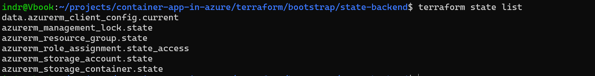

Proves the bootstrap state still contains the storage account, container, resource group, role assignment, and lock.

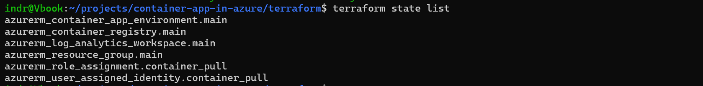

Proves the platform state still contains all six platform resources and did not absorb the backend resources.

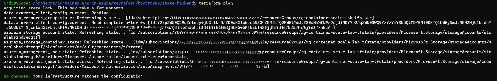

Proves a plan from the migrated bootstrap root refreshed the real resources and reported no changes.

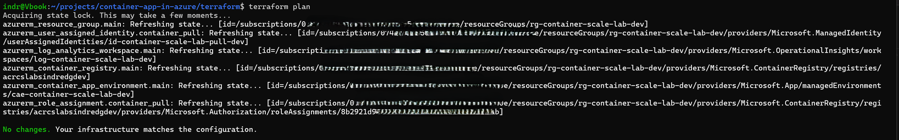

Proves the same for the platform root across all six resources.

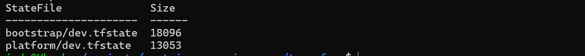

Proves both keys exist as real blobs, listed with `--auth-mode login` rather than an account key.

## Cleanup

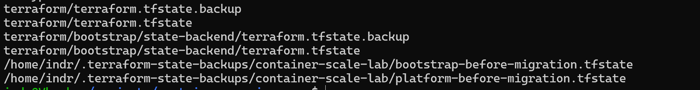

Proves the local state files and the two temporary migration backups were located by exact path before deletion, rather than removed with a wildcard.
