# Phase 6 worklog: First Web Container

## Goal

Build and test the first application image locally with Docker through WSL, before anything reaches a registry or Azure. Nginx serves a static page on port `8080` and exposes `/health`.

## Build

Five files under `app/web/`: `.dockerignore`, `Dockerfile`, `nginx.conf`, `index.html`, `styles.css`.

```bash
docker build --tag container-scale-web:0.1.0 .
```

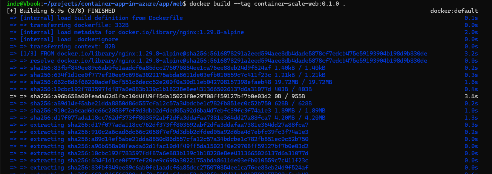

The image built from `nginx:1.29.8-alpine` and completed all build steps without error.

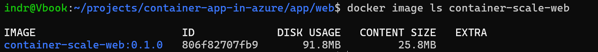

The image was stored under the immutable tag `0.1.0`.

## First failure: wrong configuration level

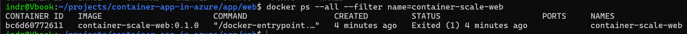

The container did not stay running, and no port mapping was established.

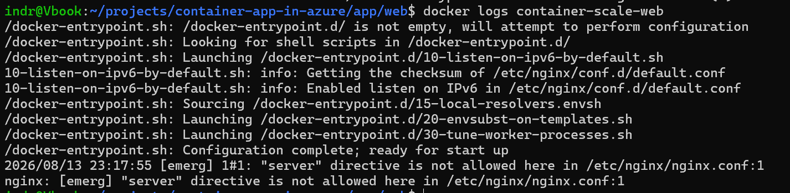

The cause was `"server" directive is not allowed here`, a configuration context error rather than a syntax error.

The custom file held a `server {}` block but had been copied over `/etc/nginx/nginx.conf`, which expects the complete top-level configuration. The destination was corrected to `/etc/nginx/conf.d/default.conf`. Full write-up in the [troubleshooting log](../troubleshooting.md#nginx-container-exited-immediately). The same context rule returns in phase 8.

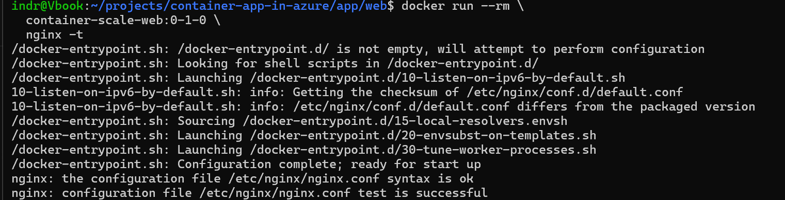

`nginx -t` on the rebuilt image passed, isolating configuration validity from runtime behaviour.

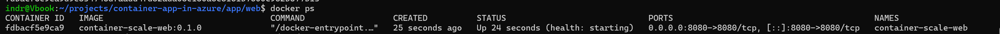

The container stayed up with host port `8080` mapped to container port `8080`.

## Second failure: healthy over HTTP, unhealthy to Docker

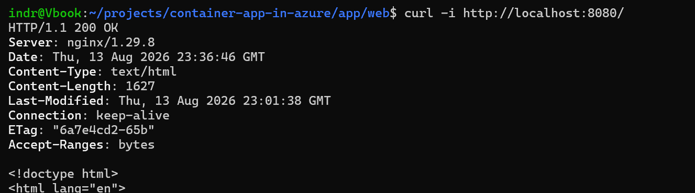

`/` returned `200` with the project's own page body.

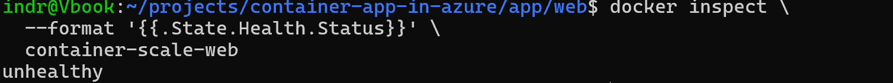

Docker's health status was `unhealthy` at the same time host-side requests were succeeding.

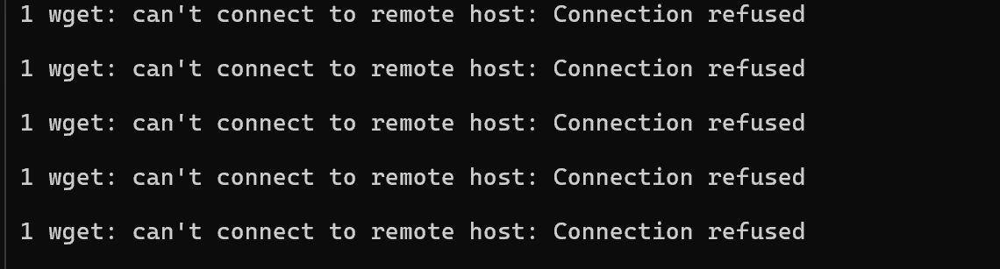

The health history was five consecutive connection refusals, so the check never reached the server.

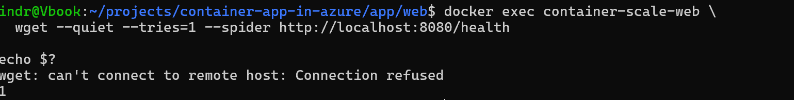

The failure reproduced inside the container using `localhost`, isolating the cause to name resolution rather than the web server.

The same request succeeded through `127.0.0.1`, so the `HEALTHCHECK` moved to the explicit IPv4 loopback address. Full write-up in the [troubleshooting log](../troubleshooting.md#docker-marked-a-working-site-unhealthy).

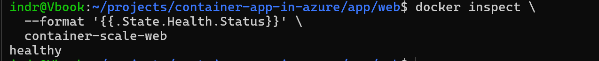

After the fix and a container recreate, Docker reported `healthy`.

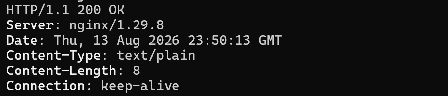

`/health` returned `200` with an 8-byte `text/plain` body.

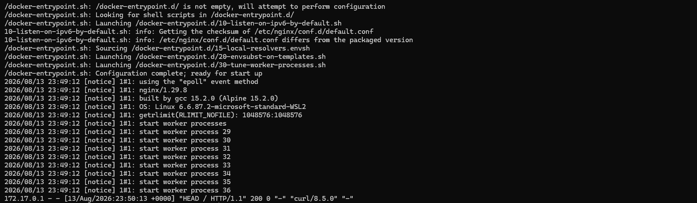

Normal startup on `nginx/1.29.8` with worker processes started, and a served request logged at `200`.

A successful host request says nothing about Docker's internal health command. Rebuilding an image does not change a running container.
