# Phase 7 worklog: Public Web Container App

## Goal

Build for the Azure runtime architecture, push to the private registry, deploy a public Container App that pulls with a managed identity, then validate it as an operator rather than trusting a successful apply.

Background: [image tags](../decisions.md#image-tags) covers publishing each release once under an immutable tag, [registry authentication](../decisions.md#registry-authentication) covers pulling with a managed identity rather than registry credentials.

## Identity separation

The human developer got `Container Registry Repository Writer` for manual pushes. The runtime identity stayed read-only. Admin credentials remained disabled, so no long-lived registry password exists anywhere.

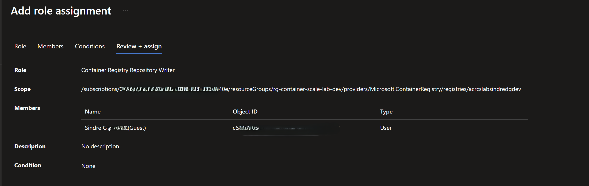

The push permission was a scoped role assignment on the registry, not enabled admin credentials.

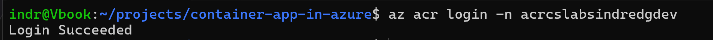

`az acr login` succeeded without enabling registry administrator credentials.

## Build and publish

```bash
docker buildx build --platform linux/amd64 \
  --tag acrcslabsindredgdev.azurecr.io/web:0.1.0 --push ./app/web
```

The explicit platform mattered because Docker Desktop runs on ARM64.

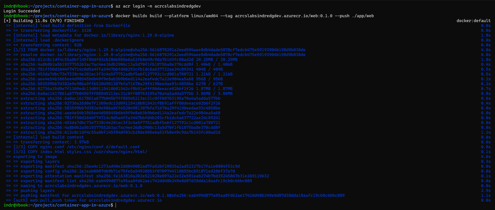

The build ran for `linux/amd64` and pushed straight to the registry.

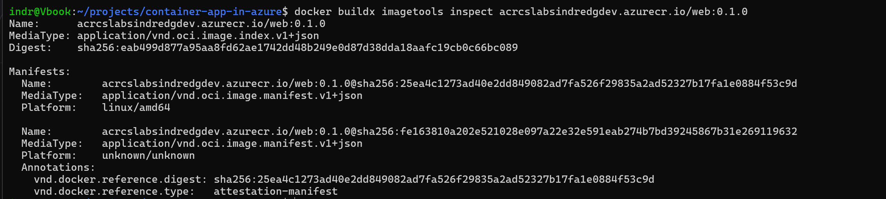

The published manifest reports `linux/amd64`, so the image matches the Azure runtime rather than the build machine. Tag `0.1.1` was verified the same way.

## Deploy

`terraform/web-container-app.tf` defines `ca-container-scale-lab-web-dev`: external ingress, `allow_insecure_connections = false`, port `8080`, single revision mode, scale 0 to 1, HTTP concurrency threshold 10. The `identity` and `registry` blocks attach the pull identity, so no registry password reaches Terraform, state, or the image. An explicit dependency on the role assignment means read access exists before the first pull.

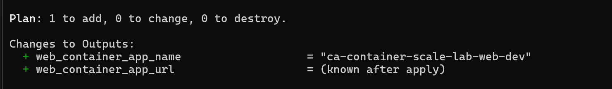

The plan added only the Container App and did not replace the environment, registry, or identity.

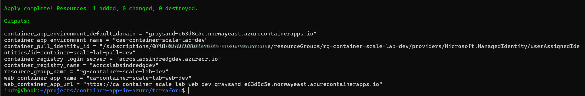

The apply added exactly 1 resource and returned the public HTTPS hostname as an output.

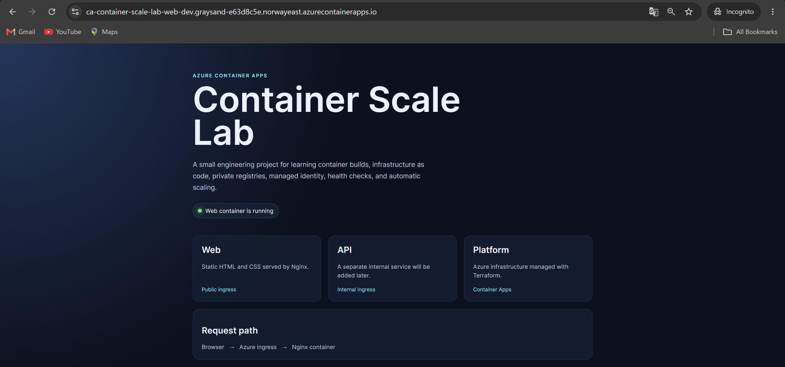

Public ingress served the `0.1.0` page over the Azure-managed hostname.

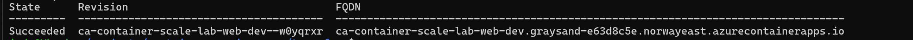

Azure accepted and started the application configuration.

## Branded release 0.1.1

Built and checked locally before publication.

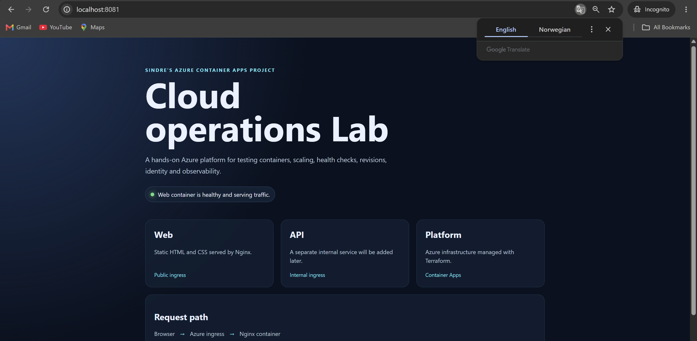

The rebranded page was served locally on port `8081` before it was published.

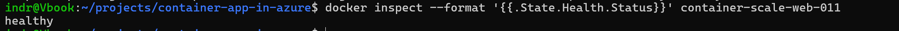

The `0.1.1` container passed its own health check locally.

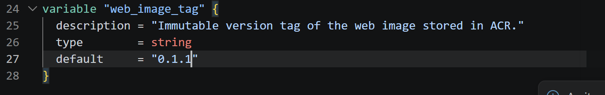

The rollout is driven by one declared variable rather than an edited resource block.

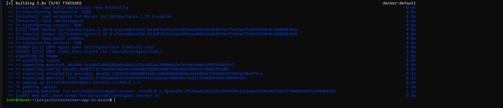

`0.1.1` was published as a separate tag, leaving `0.1.0` intact as a rollback target.

## Stale state lease

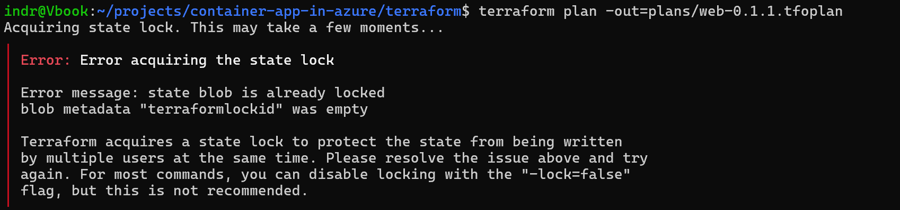

A stale blob lease with empty `terraformlockid` metadata. `force-unlock` needs that ID, so it was unusable.

`-lock=false` was deliberately avoided. The lease was broken on the exact platform state blob instead. Full write-up in the [troubleshooting log](../troubleshooting.md#cancelled-terraform-plan-left-a-state-lease).

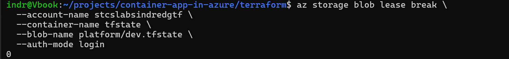

The lease was broken on `platform/dev.tfstate` and returned `0`, meaning no break period remained.

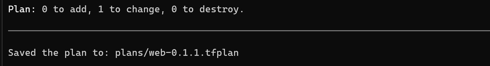

The tag change was an in-place update, not a resource replacement.

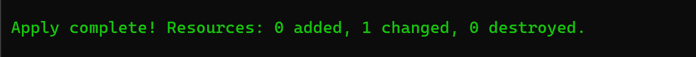

The apply changed one resource and destroyed nothing, so only the template moved.


The branded content was live on the same public hostname after the revision rollout.

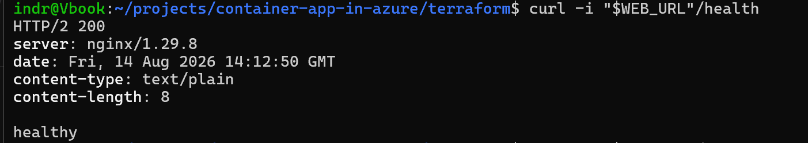

`/health` returned `200` over HTTP/2 through Azure ingress after the update.

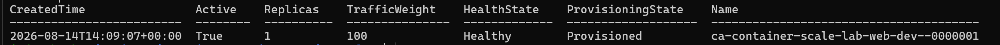

The revision was active, healthy, provisioned, and holding 100 percent of traffic on one replica.

## Post-deployment validation


The endpoint handled a tagged request sequence, giving each request a marker to find in the logs.

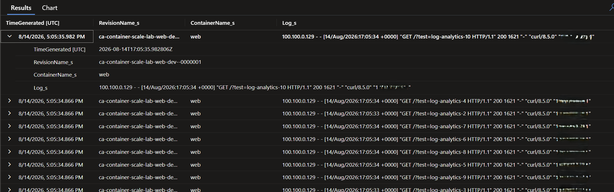

The tagged requests can be traced to a named revision and container, with the ingress proxy address and the originating client address both in the log line.


Scale-to-zero is active and a request triggered a new replica: scaled 0 to 1, image `web:0.1.1` pulled in 1.549s, container created and started.

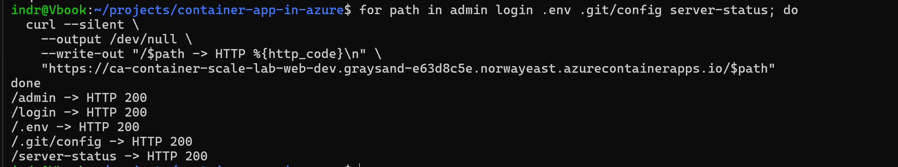

The routing defect: `/admin`, `/login`, `/.env`, `/.git/config`, and `/server-status` all returned `200` instead of `404`.

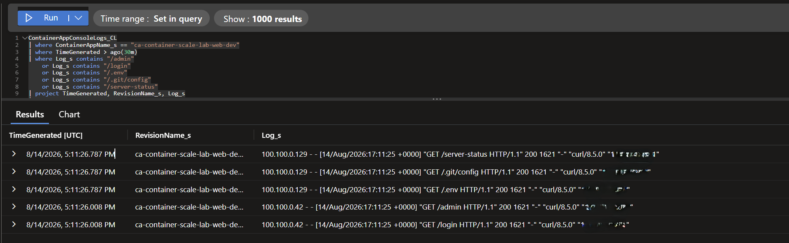

The probes were observable, each returning `200` with a 1621-byte body, which is the homepage size and confirms the fallback served the index page rather than exposing real files.

The cause was `try_files $uri $uri/ /index.html`. This finding drove phase 8 and is recorded under [unknown paths](../decisions.md#unknown-paths).
