# Phase 8 worklog: Web Routing, Response Hardening, and Log Privacy

## Goal

Correct the routing defect found in phase 7 validation, stop responses advertising the Nginx version, add protective headers, and reduce what the access log records about clients. Released as `0.1.2`.

Background: [unknown paths](../decisions.md#unknown-paths) on real 404s, [client address logging](../decisions.md#client-address-logging) on recording the client network, [content security policy](../decisions.md#content-security-policy) on the policy itself. Full technical detail in [phase-08](../phases/phase-08-web-routing-and-log-privacy.md).

## Before

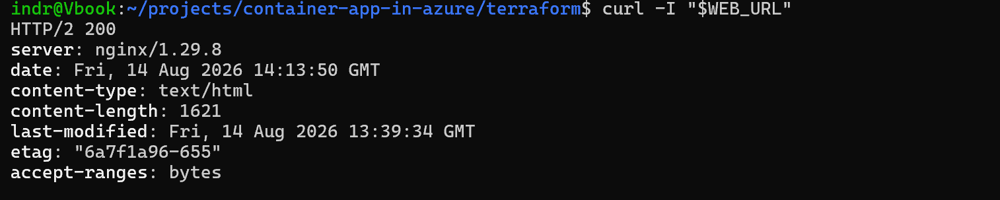

The state this phase corrects: the live site returned `server: nginx/1.29.8` with none of the four headers.

## What changed

`try_files $uri $uri/ /index.html` is right for a single-page application, where the browser routes and the server cannot know which paths are valid. It is wrong for a static site, because every unknown path returns the homepage with `200`. A scanner probing `/.env` gets `200`, and monitoring that counts error rates sees none. The fallback became `=404`.

`server_tokens off` plus four headers: `X-Content-Type-Options: nosniff`, `X-Frame-Options: DENY`, `Referrer-Policy: no-referrer`, and `Content-Security-Policy: default-src 'self'; object-src 'none'; base-uri 'none'; frame-ancestors 'none'`.

For the log, `$remote_addr` is always the ingress proxy in the `100.100.x.x` range, because every connection Nginx accepts arrives from that proxy. The real client is in `X-Forwarded-For`, which the inherited `log_format main` was writing in full. A `map` truncates it to the `/24` network first:

```nginx
map $http_x_forwarded_for $client_net {
    "~^(?P<net>\d+\.\d+\.\d+)\."  "$net.0";
    default                        "unknown";
}
```

The `^` anchor selects the original client, since proxies append to the header. `map` and `log_format` are `http` context directives, valid here for the same reason the phase 6 `server` block was not.

Truncating rather than dropping keeps the signal: repeated failures from one source still group together. The result is less identifying, not anonymous.

## Local verification


`nginx -t` inside the running `0.1.2` container passed, so the added directives sit in a legal context.

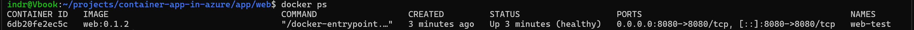

The new image ran with a passing health check before publication.

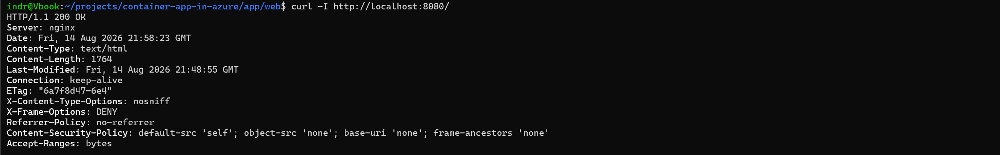

`server` is now bare `nginx`, and all four headers are present on a successful response.

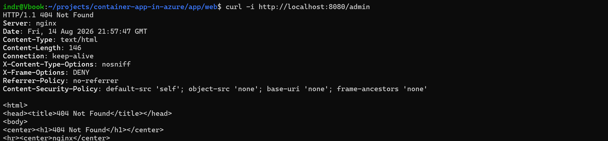

`/admin` returns a genuine Nginx `404` body, not the homepage. The headers survive on an error response, which is what `always` buys.

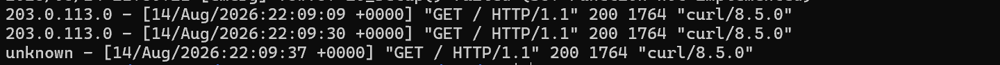

`203.0.113.45` logs as `203.0.113.0`. Same result when the proxy appends its own address. No header logs `unknown`.

`203.0.113.0/24` is the RFC 5737 documentation range, safe to use in tests.

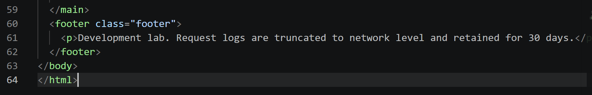

The page now states that request logs are truncated to network level and retained for 30 days.

## Release

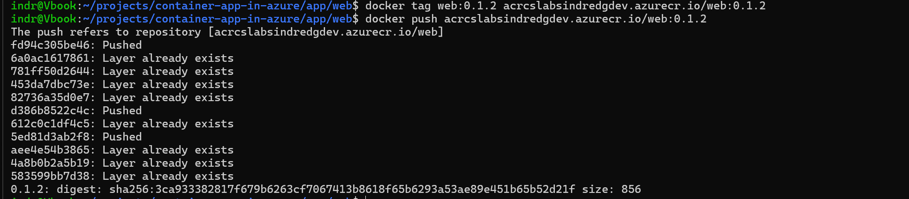

The release was published as its own digest.

A registry login that succeeded while the push failed is recorded in the [troubleshooting log](../troubleshooting.md).

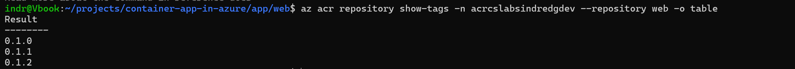

`0.1.0`, `0.1.1`, and `0.1.2` coexist, so earlier releases remain available as rollback targets.

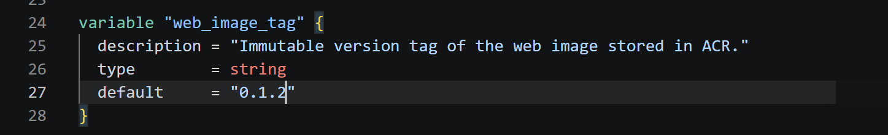

The rollout is driven by the declared variable moving to the new tag.

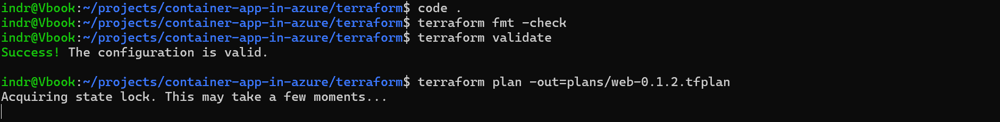

`fmt -check` and `validate` both passed before the plan was generated.


The release was 0 to add, 1 to change, 0 to destroy.

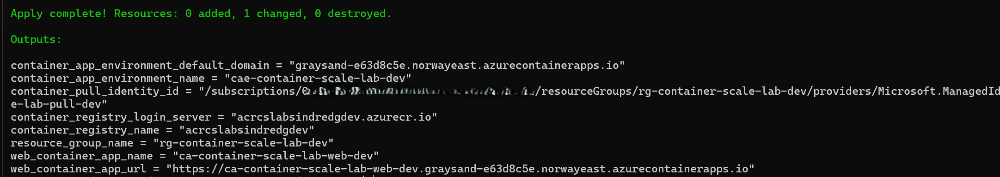

The apply changed one resource and returned the unchanged public hostname.

## Azure verification

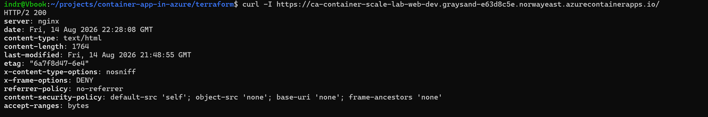

The hardening reached production over HTTP/2.

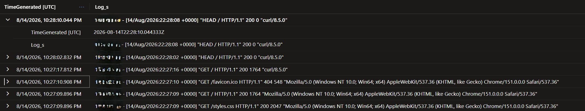

Truncation is active in Azure, and captures an unplanned confirmation of the routing change: a browser request for `/favicon.ico` returned `404 548`, where the previous configuration would have returned `200` with the full homepage.

A malformed test request that `curl --silent` hid during this round is recorded in the [troubleshooting log](../troubleshooting.md).

## Still open

- The five recon paths have not been re-run against the deployed site.
- The pull request is not merged, so no post-merge no-change plan exists yet.
