# Phase 9 worklog: Internal API Container, Local

## Goal

Add a second service to the platform and prove the two-container topology locally before it touches Azure. The web container becomes a same-origin entry point for an API that is never published directly.

Related: [decision log](../decisions.md).

## The API service

A FastAPI service on port `8080` with `/health` and `/status`. `/status` returns the service name, version, and the `CONTAINER_APP_*` revision and replica values that Azure injects, so the same endpoint reports meaningful values in Azure and placeholder values locally.

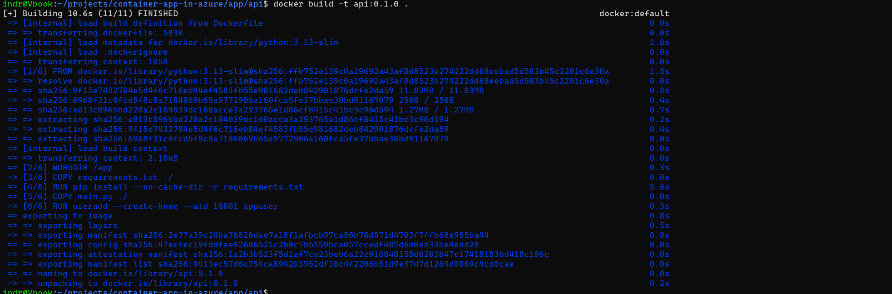

Proves the image builds from `python:3.13-slim` and adds a dedicated `appuser` with uid `10001` rather than running as root.

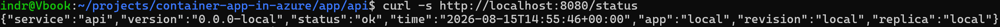

Proves `/status` returns structured JSON, and that outside Azure the revision and replica fields fall back to `local` instead of failing.

## Making nginx templated

The web container needs the API address at runtime, not build time. The site config became a template processed by the base image's `envsubst` entrypoint.

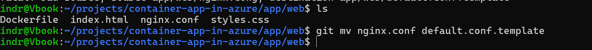

Proves `nginx.conf` became `default.conf.template` through `git mv`, so file history follows the rename.

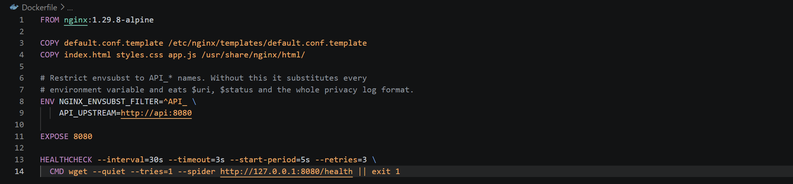

Proves `NGINX_ENVSUBST_FILTER=^API_` is set. Without it, envsubst substitutes every environment variable and destroys `$uri`, `$status`, and the whole privacy log format from phase 8.

`app.js` is copied as its own file because the Content Security Policy from phase 8 allows no inline script. That constraint was recorded then and is being paid now.

## The proxy

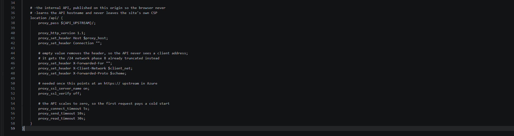

Proves the browser calls the API same-origin, that `X-Forwarded-For` is set to an empty value so the API never receives a client address, and that the already-truncated `/24` network is forwarded as `X-Client-Network` instead.

The same block sets `proxy_ssl_verify off` and short connect and read timeouts, both of which matter once the upstream is an Azure internal FQDN belonging to an app that scales to zero.

## Running both

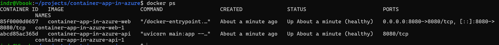

Proves the topology: the web container maps `8080` to the host, and the API container exposes `8080` inside the network with no host binding, so it is unreachable except through the proxy.

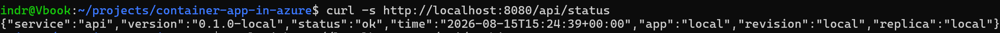

Proves `/api/status` on the web port returns the API's JSON, so the proxy path works end to end.

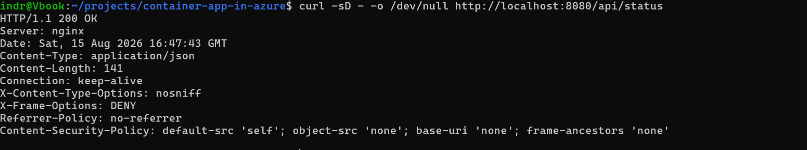

Proves all four phase 8 headers and the bare `nginx` server header are present on a successful proxied response, so adding a `location` did not drop the inherited `add_header` set.

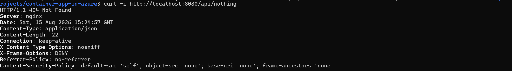

Proves an unmatched API route returns the FastAPI `404` as `application/json` rather than the static site's HTML 404, so the two routing domains stay separate.

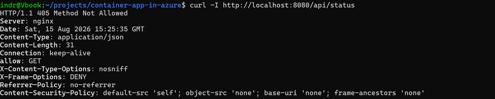

Proves `curl -I` returns `405 Method Not Allowed` with `allow: GET`. FastAPI's `@app.get` registers GET alone, unlike plain Starlette, so header checks against this API need a GET that discards the body.

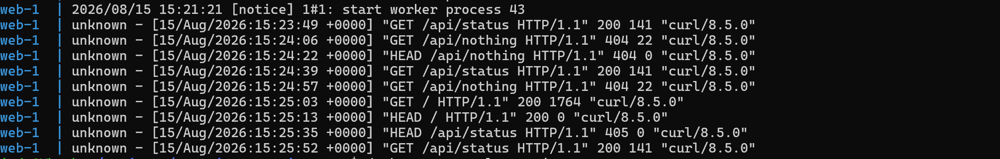

Proves the phase 8 privacy format still applies to proxied requests, logging `unknown` where no forwarded address exists, and records the full sequence of `/api/` requests including the `405`.
