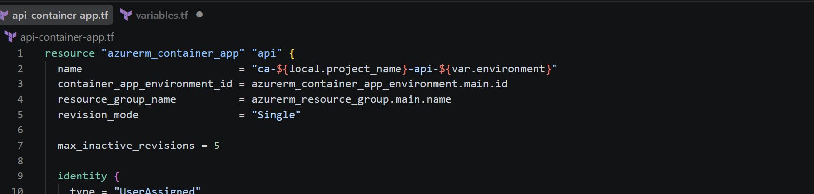
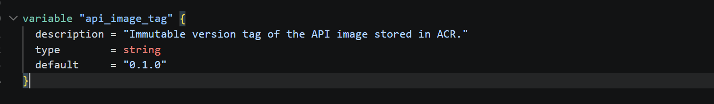
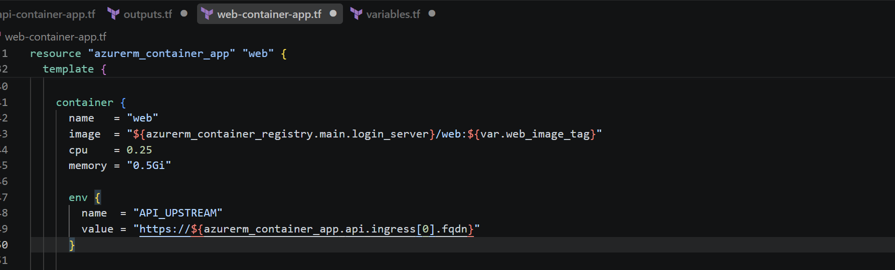
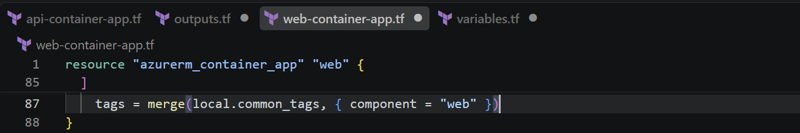
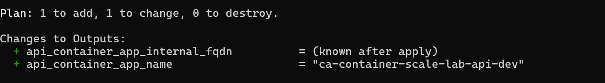
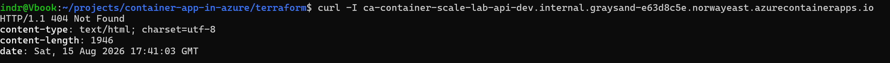
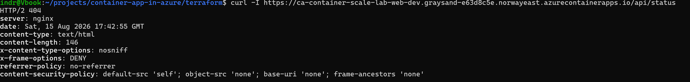
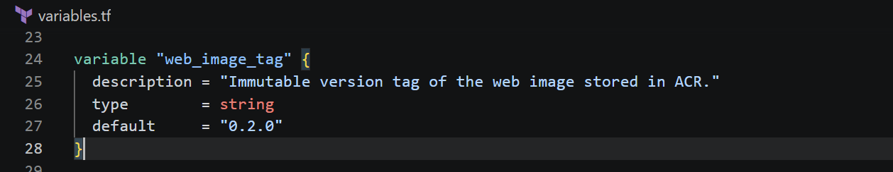
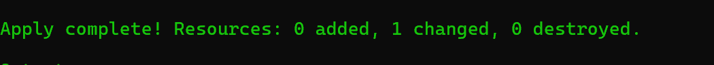
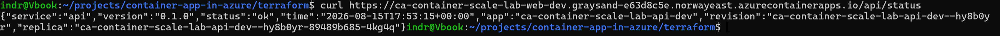

# Phase 10 worklog: Internal API Container App

## Goal

Deploy the API to Azure with internal ingress only, and reach it from the browser through the public web app. This is the first phase where the platform has a private service boundary rather than a single public app.

Related: [expose only the web app publicly](../decisions.md).

## The API Container App

Proves the API is a second `azurerm_container_app` in the same environment and resource group, in single revision mode, following the naming pattern of the web app.

Its ingress sets `external_enabled = false`. It reuses the pull identity from phase 4 rather than creating a second one, so the read-only registry permission covers both services without another role assignment.

Proves the API follows the same immutable tag discipline as the web app, starting at `0.1.0`.

`SERVICE_VERSION` is passed from the image tag, so the version reported by `/status` cannot drift from the artifact that is actually running.

## Wiring the web app to it

Proves `API_UPSTREAM` is derived from the API's own ingress FQDN in Terraform, so the address is never hardcoded and updates automatically if the app is recreated.

Proves the shared tag set is extended per app, which keeps the two services separable in cost and inventory views.

Proves the change was 1 to add and 1 to change, adding the API and updating the web app, with the internal FQDN only knowable after apply.

## Verification

Proves a request to the API's own hostname from a workstation returns `404` from the Azure front end rather than the API, so internal ingress is doing its job.

Proves the deployed web image did not contain the `/api/` block. The environment variable had applied, but `web_image_tag` was never moved off `0.1.2`, so the running image predated the proxy. Nginx returning its own `404` rather than a `502` is what identified this: a missing location, not a failing upstream.

Proves the fix was a tag bump to the image that actually contains the proxy configuration.

Proves the correction was a single in-place change with nothing added or destroyed.

Proves the full path works: a public HTTPS request to `/api/status` reaches the internal API, which reports its own revision and replica names. Those values could only come from inside the Container Apps environment.

Proves the first request after several hours idle returned `504`, and an immediate retry returned `200` with the four security headers and a version-free `server` header on a proxied response. Waking a replica from zero exceeded the 30 second `proxy_read_timeout`, so scale to zero has a cost that falls on the first visitor.

## What this phase established

The platform now has two services with different exposure. The web app is the only public entry point, the API is reachable only from inside the environment, and the browser never learns the API hostname because every call is same-origin. Both pull private images with the same read-only identity.

## Open items

- `proxy_ssl_verify` is off, pending a check on whether the internal FQDN presents a chain the container trusts.
- `/api/openapi.json` and `/api/health` are reachable through the proxy, so the API's schema and probe endpoint are publicly readable.
- The API has no authentication and relies on internal ingress alone.
- The first request after a long idle can return `504`. Waking a replica from zero exceeded the 30 second `proxy_read_timeout`, and an immediate retry returned `200`.
- The five recon paths have not been re-run against the deployed site.