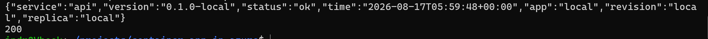

# Phase 11 worklog: API Authentication and Upstream TLS

## Goal

Close the three items deferred in phases 9 and 10. The API had no authentication, its generated schema was public, and the proxy skipped TLS verification on the upstream.

Released as `api:0.2.0` and `web:0.3.0`.

## Authentication

Terraform generates the shared secret with `random_password` and holds it as a Container Apps secret on both apps. Nginx sends it as `X-Api-Key`, FastAPI compares it with `hmac.compare_digest`. No human handles the value and it never enters Git.

`/health` is exempt. The platform probes call the container directly rather than through the proxy, so requiring the secret there would fail every probe and the app would never start.

The auth middleware is registered before the logger. Starlette makes the last registered middleware outermost, so this ordering keeps logging on the outside and a rejected request still produces a log line. Reversed, 401s would be invisible.



The happy path: the proxy supplies the key and `/api/status` returns 200 with the JSON body.


The closed path: calling `http://api:8080/status` from inside the web container, bypassing the proxy, returns `401 Unauthorized`.

## Upstream TLS

`proxy_ssl_verify` was off in phase 10 pending a check on the certificate. The check answered it. The internal ingress presents a publicly trusted Microsoft certificate whose SAN covers `*.internal.<environment domain>`:

```text
issuer=C = US, O = Microsoft Corporation, CN = Microsoft TLS G2 RSA CA OCSP 04
SAN: *.graysand-…, *.scm.graysand-…, *.internal.graysand-…, *.ext.graysand-…
Verification: OK
```

Verification was always achievable. It is now on.

Two details it depends on. The nginx alpine image needs `ca-certificates` installed or there is no trust store to check the chain against. And nginx defaults `proxy_ssl_verify_depth` to 1, which stops at the leaf and rejects this chain, because it reaches a root through one Microsoft intermediate. Depth is set to 3.

## Schema

`docs_url` and `redoc_url` were already disabled, because their assets come from a CDN the Content Security Policy blocks. Only `openapi.json` was still served. It is now behind `ENABLE_OPENAPI`, off by default, on for local runs.

## Release


The change was 1 to add and 2 to change: the generated secret, plus both container apps picking up the new environment variable.

## Verified in Azure

| Check | Result |
|---|---|
| Running images | `web:0.3.0`, `api:0.2.0` |
| Site root | `200` |
| `/api/status` through the public site | `200`, version `0.2.0`, revision `--0000002` |
| `/api/openapi.json` | `404` |

The 200 on `/api/status` is also the proof that `proxy_ssl_verify on` works in production. The request only succeeds if the trust store in the built image can verify the internal endpoint.
