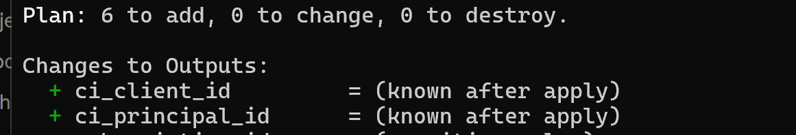
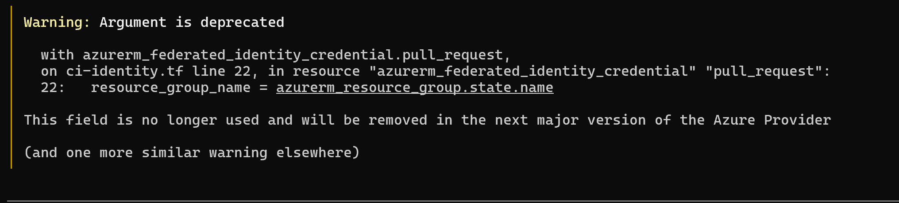
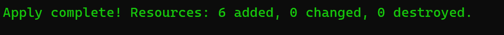
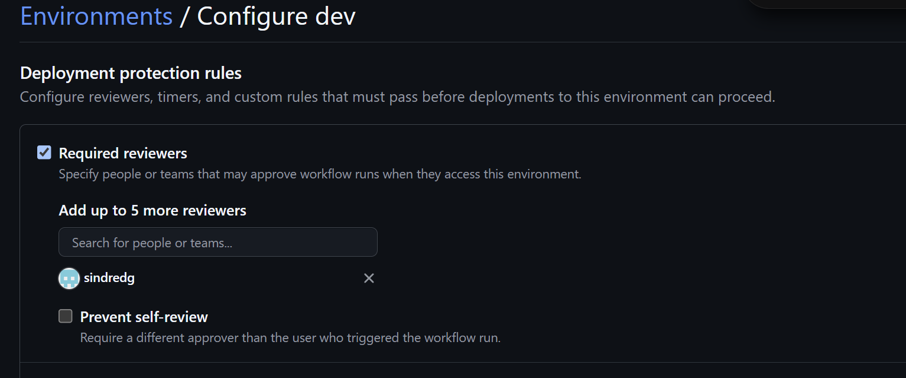
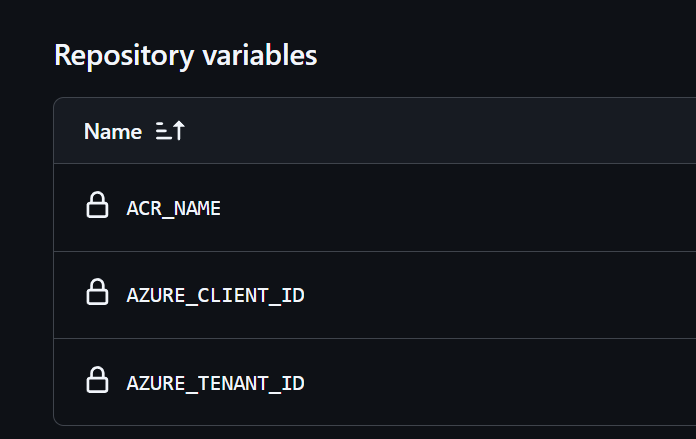
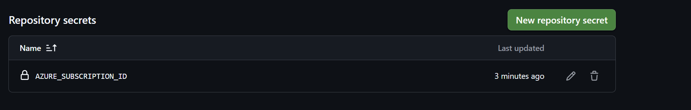
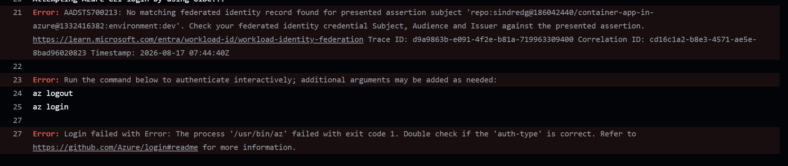
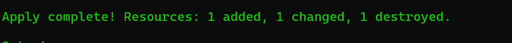
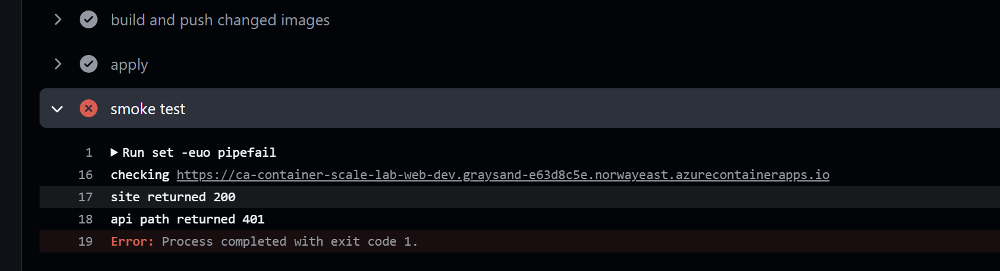
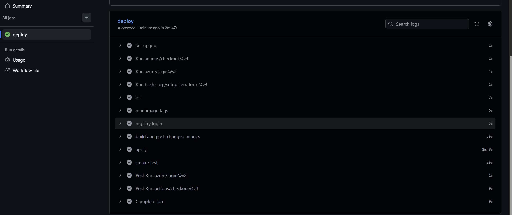

# Phase 12 worklog: GitHub Actions Pipeline

## Goal

Stop building images and applying Terraform by hand. Every pull request shows its plan, and merging to `main` builds, pushes, applies, and smoke tests behind an approval gate.

## Identity

A user-assigned managed identity with federated credentials. GitHub presents a short-lived OIDC token, Entra checks it against the credentials and issues an access token. No client secret exists at any point.

The identity lives in the bootstrap root, not the platform root. A human applies bootstrap. CI only ever applies platform. The pipeline therefore cannot widen its own permissions, because its grants sit outside what it can change.

Permissions are Contributor scoped to the dev resource group, Storage Blob Data Contributor on the state account, and Container Registry Repository Writer, which allows push but not delete.

Proves the change is 6 resources: the identity, two federated credentials, and three role assignments.

Proves `resource_group_name` on `azurerm_federated_identity_credential` is no longer used. The identity already carries the resource group through the parent reference. Removing it cleared the warning without changing the plan. `parent_id` was also renamed to `user_assigned_identity_id`, which the 4.x provider already accepts and version 5 requires.

Proves all 6 resources were created.

## GitHub configuration

Proves the approval gate exists. The apply job targets this environment, so a run waits for a human before touching Azure.

Proves the identifiers are stored as variables. A client ID and tenant ID name things, they do not authenticate anything on their own.

Proves the split. There is no client secret to store, which is the point of federated credentials.

## The OIDC subject failure

The first run failed at login.

Proves the presented subject was `repo:sindredg@186042440/container-app-in-azure@1332416382:environment:dev`, and no credential matched it.

Two separate faults, either of which alone would have failed.

GitHub qualifies the owner and repository in the subject with their numeric IDs. The credentials used the plain `repo:owner/repo` form. The IDs were confirmed against the GitHub API. The purpose of the format is that trust cannot be inherited by renaming a repository or reusing an abandoned namespace.

A job that targets an environment receives an environment claim instead of a ref claim, not in addition to it. The apply job uses the `dev` environment for its gate, so `ref:refs/heads/main` was never going to appear. That credential was replaced rather than supplemented.

The subject prefix is now built once in a local from variables, so the two credentials cannot drift apart.

Proves the fix landed: 1 added, 1 changed, 1 destroyed. The new environment credential, the corrected pull request subject, and the dead ref credential removed.

Full write-up in the [troubleshooting log](../troubleshooting.md).

## The stale image failure

Login, build, and apply then all passed, and the smoke test failed.

Proves the site returned 200 and `/api/status` returned 401. The API enforced the shared secret. The web image did not send it.

The cause was the build step. Tags are immutable, so an existing tag is never rebuilt. Nothing checked whether the source had moved on without its tag moving with it. Phase 11 changed both applications and bumped neither version, so both builds were skipped and the deployment shipped images that did not match the commit.

`web:0.2.0` was pushed on 15 August and predates the change. `api:0.1.0` carried it. The pair was inconsistent.

This is the phase 10 stale image incident repeated, this time automated. That one was caught by hand within minutes. This one would have persisted silently without the smoke test.

The build step now fails when a service's source changed in the push but its tag is already published, and names the variable to bump. A red build is better than a deployment that does not match the commit.

## Result

Proves the full path: login, init, read tags, registry login, build and push, apply, smoke test. 2 minutes 47 seconds end to end.

The release loop is now one action. Bump the tag in `variables.tf`, open a pull request, merge. Everything else follows.

## Open

ACR does not enforce tag immutability by default, and `api:0.1.0` was overwritten during this phase. Whether that is worth turning on is an open question, deliberately left until there is evidence from normal pipeline runs rather than a single unexplained timestamp.
