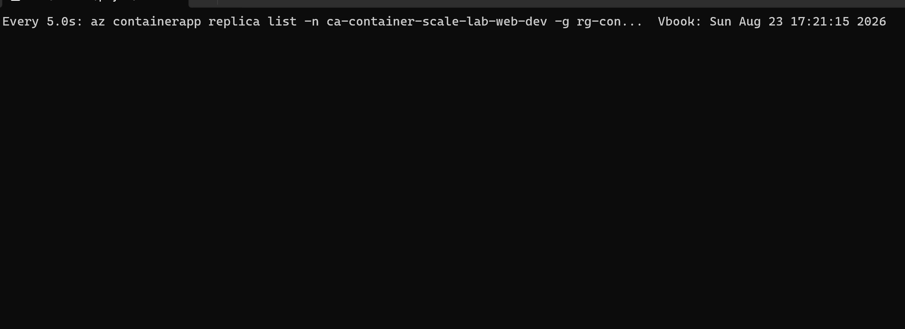
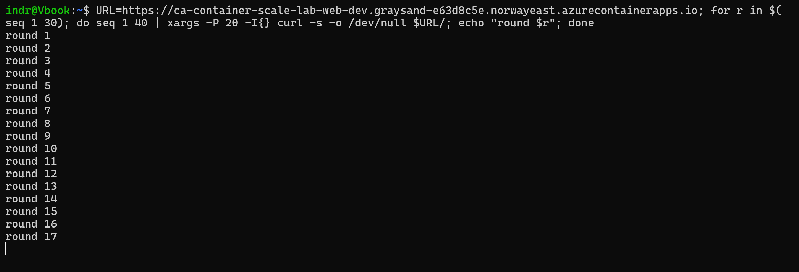
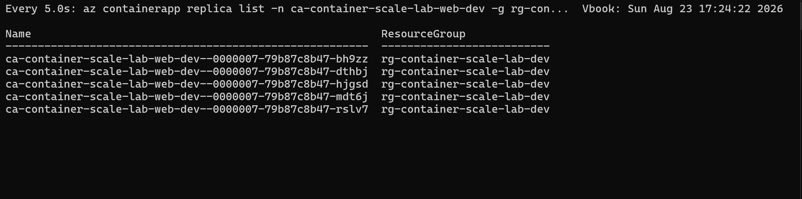
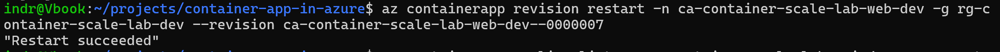
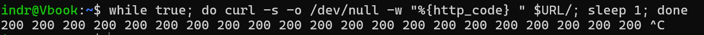

# Phase 13 worklog: Scaling and Release Mechanics

## Goal

Prove the platform scales under load and can roll back a bad release without redeploying. These were the two largest open items in the blueprint definition of done.

## Multiple revision mode

Single revision mode allows one active revision. Rolling back therefore means deploying the old version again and waiting for it to start. Multiple revision mode keeps the previous revision alive, so rollback becomes a traffic weight change.

Traffic is driven by two variables. Leaving `web_previous_revision_suffix` empty sends everything to the newest revision. Setting it adds a second weight, so a canary split, a promotion, and a rollback are the same one variable change reviewed as a plan.

`max_inactive_revisions` keeps the previous revision alive long enough to be a rollback target.

## Scale test

The replica ceiling and concurrency threshold moved from hardcoded values to variables whose defaults matched what was deployed, so the refactor planned clean. Running the test then became a reviewed variable change rather than an edit to the resource.

For the test the ceiling went to 5 and the threshold to 2, which is low enough that scaling happens fast enough to watch.



Proves the starting point. The app had scaled to zero, so nothing was running and nothing was being billed for compute.



Proves the load: 20 concurrent requests at a time, repeated, against the public endpoint.



Proves scale-out reached the ceiling of 5 within about three minutes of load starting. No request failed during the test.

Both values returned to 1 and 10 afterwards.

## The revision naming flaw

Revision names were derived from the image tag, so a revision would be called `--0-3-0` rather than an opaque Azure number.

The scale test showed the idea only half worked:

```text
--0-3-0     0%    from the revision mode change
--0000007   100%  from the scale change, auto named
```

A configuration change does not touch the image, so the tag stays the same. Azure will not create a second revision with a name that already exists, so it silently falls back to auto numbering. Since most changes are configuration rather than releases, most revisions were still getting meaningless names.

The suffix now includes a short hash of the values that actually define a revision, which keeps the release version readable and the name unique:

```text
revision_suffix = "0-3-0-876fac"
```

The failure was quiet. Nothing errored, the deployment succeeded, and the only symptom was a revision name that looked like the ones the change was meant to replace.

## Probe recovery

Startup, readiness, and liveness probes were configured in phase 7 but never observed doing anything. Configuration is not evidence.

A replica was restarted while the site was polled once a second.



Proves the restart was issued against the revision serving traffic.



Proves no request failed. Every response through the restart was 200.

The system log explains why:

```text
Readiness probe failed: connect: connection refused
Readiness probe failed: connect: connection refused
Container created
Container started
Successfully pulled image "web:0.3.0" in 67ms
```

The readiness probe failing is the mechanism working, not a fault. While a replacement container was starting and not yet answering on `/health`, the probe marked it unready and Azure kept it out of the load balancer. Traffic went only to replicas that could serve it.

Without a readiness probe the platform would have routed requests to a container that was still starting, and those requests would have failed.

## Result

| Check | Result |
|---|---|
| Scale out | 0 to 5 replicas under load |
| Requests during scaling | No failures |
| Scale in | Back to zero after the 300 second cooldown |
| Rollback mechanism | Traffic weight, no redeploy |
| Revision names | Unique per configuration, release version readable |
| Restart recovery | Replicas replaced with no failed request |
