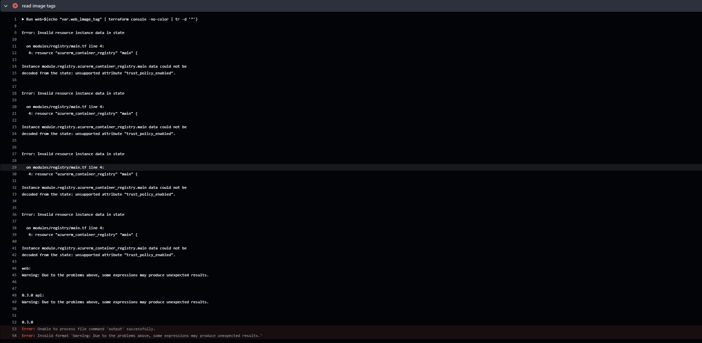
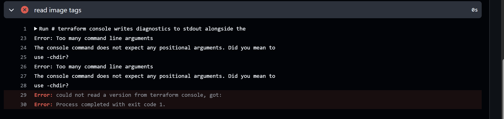
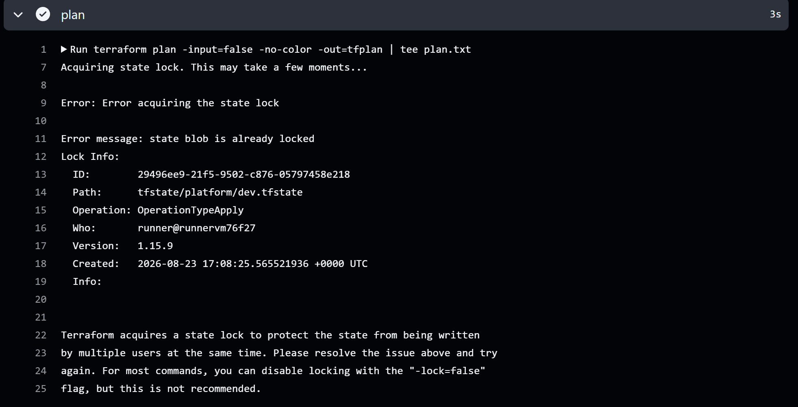
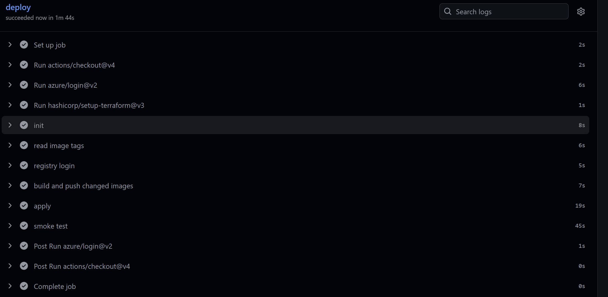

# Phase 15 worklog: Terraform Module Migration

## Goal

Restructure a flat Terraform root into modules grouped by capability, matching the layout the network project already used, then bring the provider up to 5.x.

## The structure

```text
terraform/
  main.tf          module calls and wiring
  modules/
    platform/      resource group, Log Analytics, Container Apps environment
    registry/      ACR, pull identity, role assignment
    web-app/       public web Container App
    api-app/       internal API Container App
```

Two design choices worth recording.

**The shared secret stayed at the root.** Both applications hold it, so it belongs to neither module alone. Moving it into `api-app` would have meant a sensitive output and an artificial dependency from `web-app`.

**Two app modules rather than one generic module used twice.** The apps differ in ingress, traffic weights, revision naming, and environment. A single module covering both would need a dozen optional inputs, and every reader would have to hold both cases in their head. If a third app appears that resembles one of these, that is the moment to extract a shared module.

## The risk, and how it was handled

Moving a resource into a module changes its Terraform address:

```text
azurerm_container_registry.main  ->  module.registry.azurerm_container_registry.main
```

Terraform reads that as the old one being gone and a new one being needed. For the registry that means destroying it and losing every published image, including the ones the running apps pull from.

`moved` blocks map each old address to its new one, so Terraform treats it as a rename.

The acceptance criterion was set before the work started: if the plan is not all moves, stop. It was met. Seven moves, plus one in-place change that turned out to be unrelated drift. Running plan on `main` with no refactor present produced the identical change, which proved the restructure contributed nothing beyond the address moves.

`moved.tf` was deleted in a follow-up once applied, since a rename map that has been applied only suggests a move is still pending.

## Provider upgrade

Both roots moved from `~> 4.0` to `~> 5.0`, resolving to 5.2.0. Both validated, and both planned with no changes.

It was that quiet because the two breaking changes affecting this configuration had already been fixed weeks earlier, when they appeared as deprecation warnings during the pipeline work: `parent_id` became `user_assigned_identity_id`, and `resource_group_name` was removed from federated credentials.

Acting on warnings at the time they appear is the whole reason the major upgrade was a no-op.

## What the plan could not show

The upgrade broke the pipeline in a way an empty plan gave no warning about.



State written by the 4.x provider carried `trust_policy_enabled` on the registry, an attribute 5.x removed. `plan` tolerated it because it refreshes from Azure. `terraform console` decodes state directly, so it failed.

Cleared with `terraform apply -refresh-only`, which updates state from reality and changes no infrastructure.



A second, separate fault. The fix for the first one wrote a literal backslash-n where a line continuation was meant, so bash passed it and everything after it to `terraform console` as positional arguments.

The version guard added alongside caught it. It saw the empty result and failed the step with a clear message rather than writing an empty image tag and failing later somewhere less obvious.



A third issue, unrelated to the upgrade. Nothing prevented two workflow runs at once, so a plan and an apply raced and one died on the lock. The lock behaved correctly. The pipeline did not.

Both workflows now share a concurrency group so runs queue. `cancel-in-progress` is deliberately false, because cancelling a running apply is how this project orphaned a state lease in phase 7.

## Result



The full path working after all three fixes: login, init, read image tags, registry login, build, apply, smoke test. 1 minute 44 seconds.

| Check | Result |
|---|---|
| Refactor plan | Address moves only, no resource changes |
| Registry | Survived, images intact |
| Provider 5.x | Both roots plan with no changes |
| Pipeline | Green end to end |

## Notes

A clean plan is not proof that a change is safe. The 5.x plan was empty and honest, and the upgrade still broke a pipeline step that reads state directly rather than refreshing it. Plan exercises infrastructure, not every code path around it.
