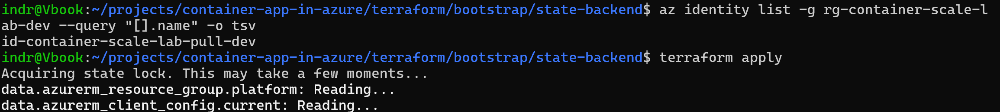
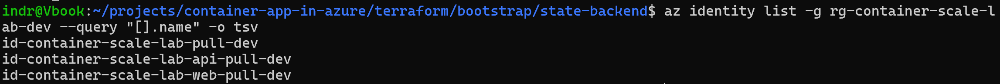
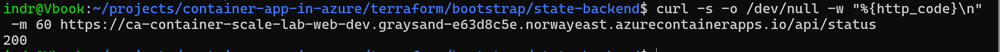

# Phase 16 worklog: Per-App Pull Identities

## Goal

Both applications shared one identity holding registry-wide read access. Give each its own, scoped to the single repository it runs.

## Why it mattered

Compromising either container granted the same access to every repository, and an audit log could not say which application pulled what. The registry has been in ABAC mode since phase 4, so the capability existed and had never been used.

## The condition

An ABAC-enabled role assigned without a condition is registry wide. The condition is the entire mechanism, not a refinement on top of one.

```text
(
 (
  !(ActionMatches{'...repositories/content/read'})
  AND
  !(ActionMatches{'...repositories/metadata/read'})
 )
 OR
 (
  @Request[...repositories:name] StringEqualsIgnoreCase 'web'
 )
)
```

It reads: unless the action is reading repository content or metadata, allow it. If it is, the repository name must match. That shape avoids denying actions the condition does not describe.

## The permission boundary that shaped the design

The first attempt put the identities and their grants in the platform root, which CI applies. The deploy created both identities and then failed:

```text
does not have authorization to perform action
'Microsoft.Authorization/roleAssignments/write'
```

The CI identity holds Contributor, which deliberately excludes managing role assignments.

This is DEC-044 working as designed rather than a misconfiguration. Worth being precise about what it protects: CI already holds Contributor on the resource group and can delete the registry, the apps, and the workspace. The boundary is not about limiting damage. It is that destruction is loud and rebuildable from Terraform, while a silent grant of access persists and is far harder to notice.

The alternative was granting CI `Role Based Access Control Administrator` on the registry. One line, and the pipeline could then change who has access to anything. Not worth the saving.

## The migration

Three steps, sequenced so nothing was ever left without a fallback.

| Step | Change | Applied by |
|---|---|---|
| 1 | Identities and grants move to the bootstrap root | Human |
| 2 | Each app attaches to its own identity | CI |
| 3 | Shared identity and its registry-wide grant removed | Human |

Steps 1 and 3 need a human because both create or delete role assignments.



Proves the starting point: a single identity holding registry-wide read.


Proves the four resources were created from the root a human applies, after the same change failed in the pipeline.



Proves both per-app identities exist alongside the shared one, which is the state the migration deliberately passes through rather than skipping.

The shared identity survived until step 3 on purpose. A wrong condition shows up as a failed image pull, and rollback should be reverting one line rather than recreating a deleted identity while the site is down.

Renaming the identities to follow the existing convention had a second benefit that was not the reason for doing it: the new names differed from the ones being destroyed, so the create and the destroy could not collide.

## Result


Proves the final step: two resources destroyed, being the shared identity and the registry-wide grant that came with it.



Proves both apps pull under their own conditions. A `200` here is only possible if each identity can read its own repository.

```text
id-container-scale-lab-web-pull-dev  ->  may read 'web'
id-container-scale-lab-api-pull-dev  ->  may read 'api'
```

No registry-wide reader remains. Both roots plan with no changes, and the site and API both return 200.

## What this phase demonstrated

The platform now has two apply paths with different trust levels. CI deploys the workload continuously without a human. Identity and permission changes cannot be automated away and need a person. That separation is deliberate, and it means "applied through the pipeline" will never cover everything.

One lesson about reading plans. Midway through the migration a plan showed `revision_suffix` pending, and that was diagnosed as a flaw in the revision naming scheme. It was not. The plan came from a branch whose earlier step had not been applied yet, so the pending change was real work waiting rather than drift. A plan describes a moment, and a plan taken mid-migration describes an incomplete one.
